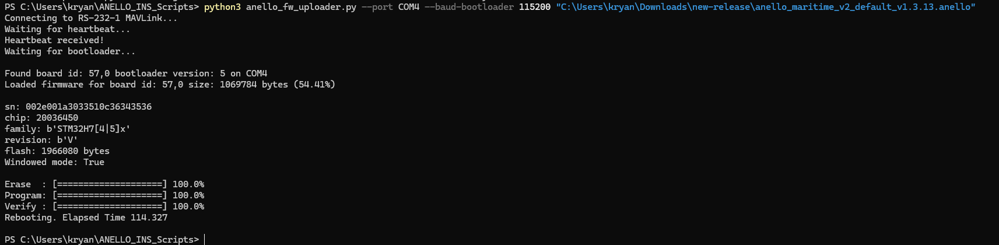
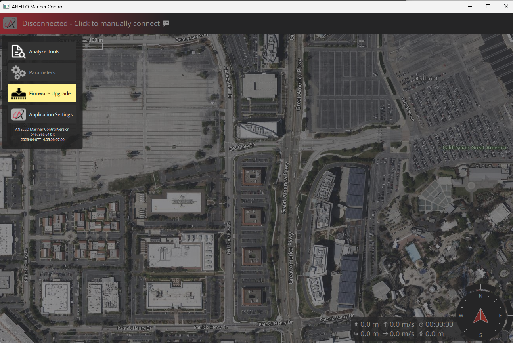
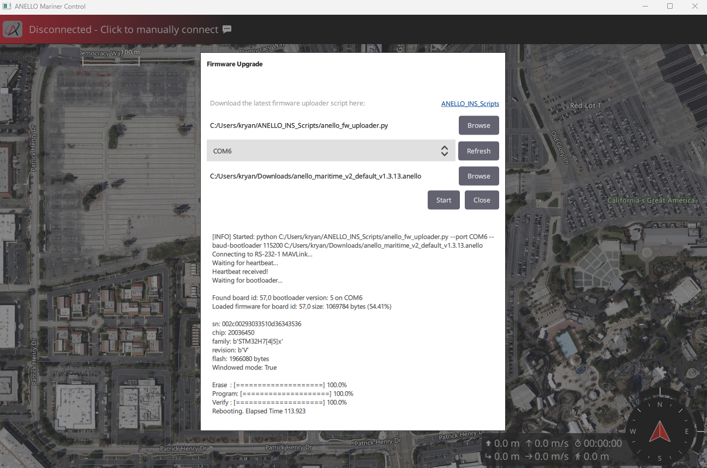

======================
Firmware Upgrade
======================

ANELLO recommends using the latest firmware (FW) for best results. The latest FW release is v1.3.13. 
If you are on an older version, please contact ANELLO for the latest FW image.

The ANELLO FW upgrade python script can be found in the following public Git repo: `ANELLO_INS_Scripts <https://github.com/Anello-Photonics/ANELLO_INS_Scripts.git>`__

Firmware Upgrade Procedure
------------------------------

FW upgrades currently must be done with the serial RS232-1 port and can be done on Windows and Linux computers.

Please ensure power and serial is not disrupted to the unit during the firmware upgrade process. 
If you experience any errors during the process, please power cycle the unit and try again.

1. Connect RS-232-1 to the computer.
2. Download the ANELLO-provided FW image onto your local computer.
3. Open Device Manager and find which serial port is the serial connection.
4. In terminal:

.. code-block:: bash
    :caption: Terminal
    
        # cd into folder with anello_fw_uploader.py
        python anello_fw_uploader.py --port COM5 --baud-bootloader 115200 /Users/user1/Downloads/anello_maritime_default.anello
        # Change "COM5" to match your port that the Maritime INS is plugged into (e.g. "COM23" on Windows or "/dev/ttyUSB0" on Linux)
        # Change "/Users/user1/Downloads/anello_maritime_default.anello" to the path to the ANELLO-provided FW image (.anello file) on your local computer

5. After it completes, you will see "Rebooting. Elapsed Time x.x" - this means the FW upgrade was successful.

Firmware Upgrade Procedure with AMarinerControl
---------------------------------------------------

To upgrade FW using AMarinerControl, the ANELLO FW upgrade python script still needs to be downloaded from the following public Git repo: `ANELLO_INS_Scripts <https://github.com/Anello-Photonics/ANELLO_INS_Scripts.git>`__

1. Connect RS-232-1 to the computer.
2. Open AMarinerControl and select "Firmware Upgrade"

3. Download the ANELLO-provided FW image onto your local computer (Link also exists in AMarinerControl FW upgrade screen).
4. Select firmware upgrade python script stored on local computer in first box.
5. Select which connected serial port is RS-232-1 in drop down menu.
6. Select path to downloaded firmware image on local computer in next box.
7. Press "Start"
8. After it completes, you will see "Rebooting. Elapsed Time x.x" - this means the FW upgrade was successful.

