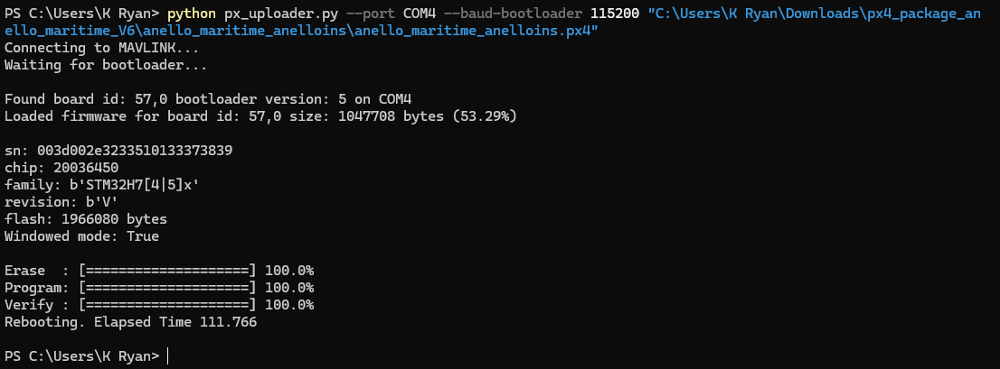

======================
Firmware Upgrade
======================

ANELLO recommends using the latest firmware (FW) for best results. The latest FW release is v1.1.9. 
If you are on an older version, please contact ANELLO for the latest FW image.

Firmware Upgrade Procedure
------------------------------

FW upgrades currently must be done with both the serial RS232-1 port and ethernet ports connected and can be done on Windows and Linux computers.

Please ensure power, serial, and ethernet connection is not disrupted to the unit during the firmware upgrade process. 
If you experience any errors during the process, please power cycle the unit and try again.

1. Connect **both** ethernet and RS-232-1 to computer and set the ethernet adapter to 192.168.0.2. Details for setting ethernet adapter can be found in the `Maritime INS Getting Started Guide <https://docs-a1.readthedocs.io/en/maritime_ins/getting_started_maritimeins.html>`_
2. Download ANELLO-provided FW image onto your local computer
3. Open device manager, and find which COM port is the serial connection.
4. In terminal:

.. code-block:: python
    :caption: Terminal
    
        # cd into folder with px4_uploader.py
        python px_uploader.py --port COM5 --baud-bootloader 115200 /Users/user1/Downloads/anello_maritime_default.px4
        # Change "COM5" to match your port that the Maritime INS is plugged into
        # Change "/Users/user1/Downloads/anello_maritime_default.px4" to the path to the ANELLO-provided FW image (.px4 file) on your local computer

8. After it completes, you will see "Rebooting. Elapsed Time x.x" - this means the FW upgrade was successful

*For support upgrading firmware with Linux, contact info@anellophotonics.com*