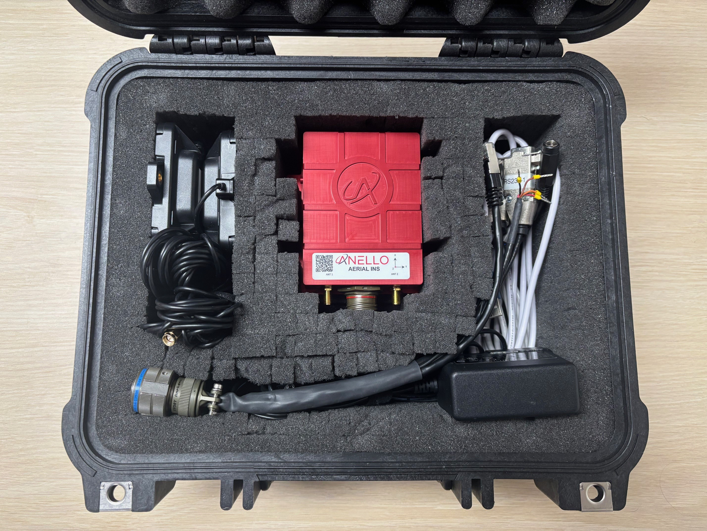
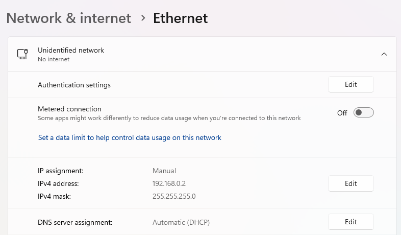
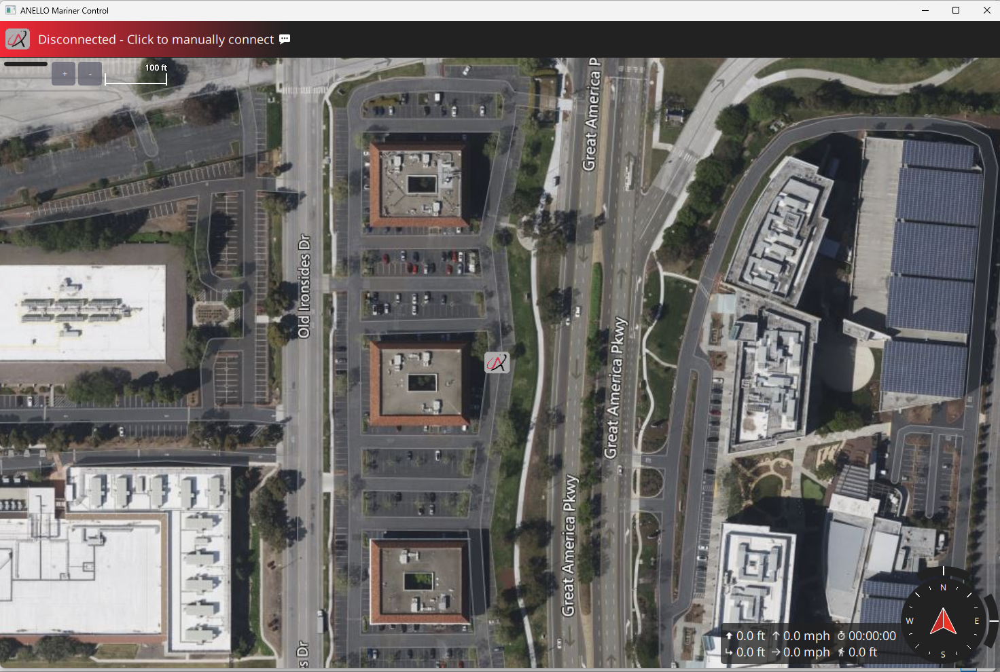
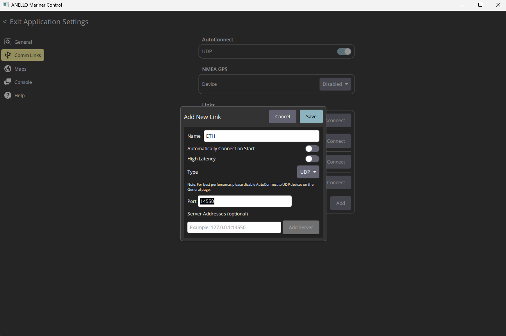
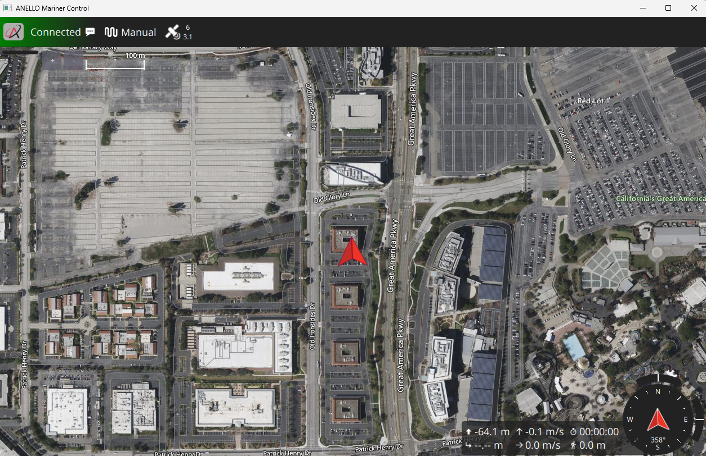
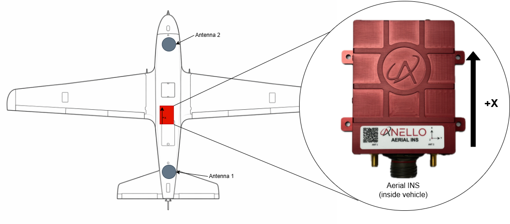
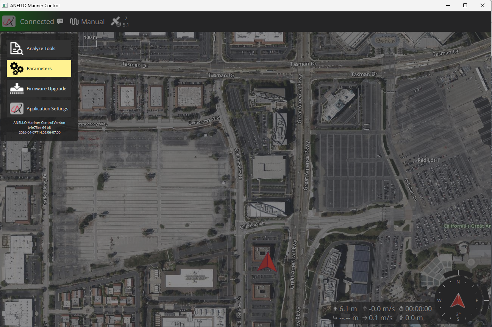
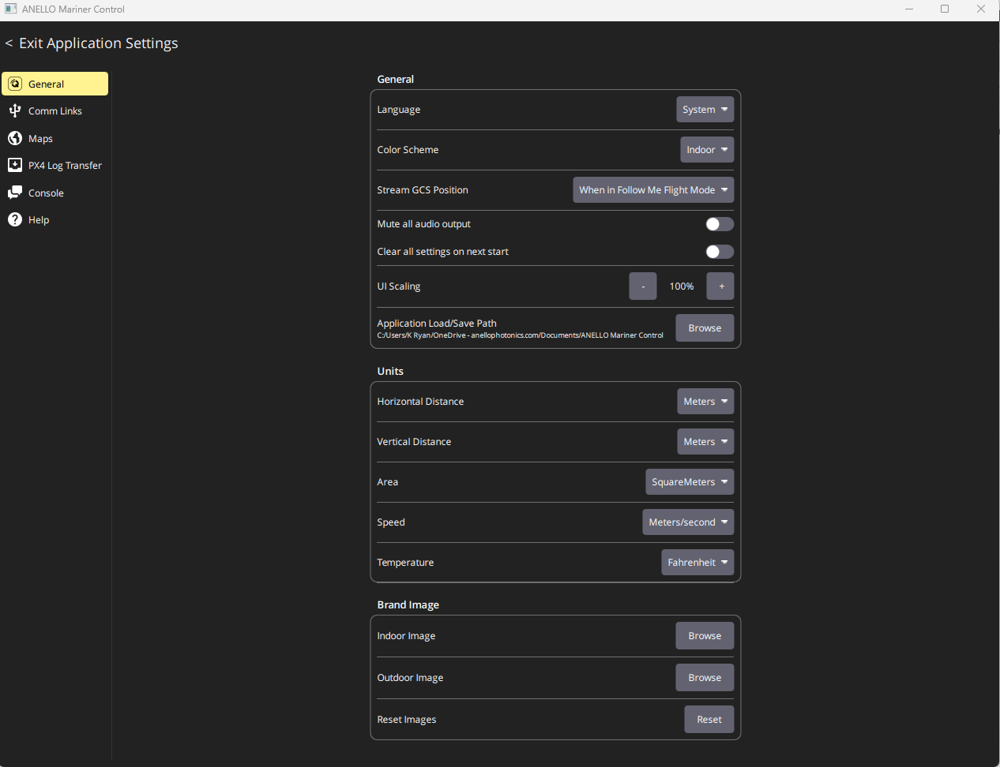
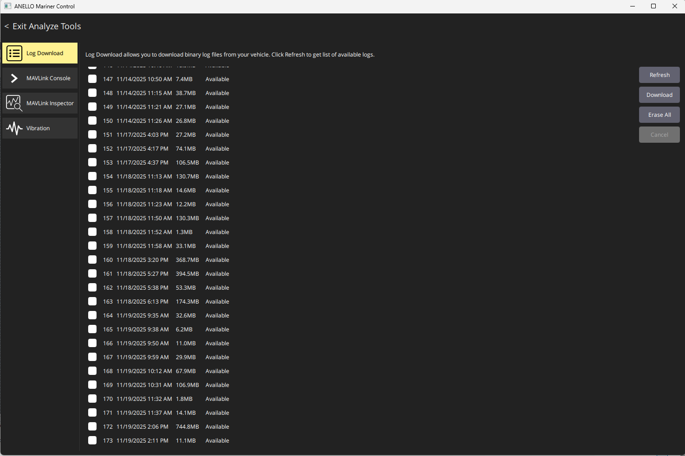

==================================
Aerial INS Getting Started Guide
==================================

Thank you for choosing the ANELLO Aerial INS! This step-by-step guide will get you started with connection, configuration, and data collection.  
Please contact support@anellophotonics.com with any questions.  

1. Hardware Connections
---------------------------------

The ANELLO Aerial INS unit is pictured below. It features a 22-pin circular connector and two female SMA GNSS connectors.

.. image:: media/ANELLO_Aerial_INS.png
   :width: 35%
   :align: center

An SCD drawing of the Aerial INS and a schematic of the accessory kit breakout cable can be found in  
`Mechanicals <https://docs-a1.readthedocs.io/en/aerial_ins/mechanicals.html>`__.

If you received an ANELLO Aerial INS Loaner unit, you will also receive the Accessory Kit pictured below. 

The kit includes the following hardware:
   a. 22 pin MIL-DTL-38999 circular breakout connector for connecting to the Aerial INS
   b. 2 Triple frequency GNSS antennae
   c. 2 USB to serial FTDI chipset adapter cables
   d. Ethernet to USB adapter cable
   e. 12V AC/DC barrel jack wall plug adapter

2. Software Interfaces
---------------------------------

Connect with the ANELLO Aerial Control software (AMarinerControl):

1. Install ANELLO's `AMarinerControl <https://github.com/Anello-Photonics/amarinercontrol/releases/v1.2.1/>`_ on your Windows (.exe), Mac (.dmg), or Linux (.AppImage) computer.

2. Set the Ethernet IP address of the host computer to **192.168.0.2** and subnet mask to **255.255.255.0**.

3. Open AMarinerControl.

4. Set up the Ethernet connection in AMarinerControl (only needs to be done once):

   a. Click the **A** button (top left) → Application Settings → Comm Links → Add New Link  
   b. Name: ETH
   c. Type: UDP  
   d. Port: 14550

   You can also check "Automatically Connect on Start" to automatically use these comm link settings to connect to the Aerial INS every time the application is opened.

5. Connect the Aerial INS to the computer using Ethernet.

6. Once connected, the status in the top left of AMarinerControl changes from **Disconnected** to **Connected**.

3. Vehicle Installation
----------------------------

The ANELLO Aerial INS can be configured for various installation positions as long as parameters are set as detailed in the next section.  
An external speed-aiding sensor is highly recommended to maintain accuracy in GPS-denied conditions. 
Calibration procedures for common sensors are detailed in  
`Sensor Calibrations <https://docs-a1.readthedocs.io/en/aerial_ins/sensor_calibrations.html>`__.

It is recommended that the Aerial INS be installed with the **X axis facing forward** and as close to the centerline as possible.  
If this is not possible, configure **SENS_BOARD_ROT** and **EKF2_IMU_POS_...** offsets accordingly.

Below is the recommended installation configuration, with the longest possible antenna baseline (distance between antennae). A minimum of a 1 meter baseline is required to ensure optimal dual antenna heading accuracy.

Ensure that antennae are mounted on a ground plane of at least 10 cm x 10 cm and with no obstructions to open sky view.

4. Configure ANELLO Aerial INS
---------------------------------

4.1 Configurations Overview
~~~~~~~~~~~~~~~~~~~~~~~~~~~~~~~~

The Aerial INS is shipped with the following communication interfaces configured:

* ``RS232-1``: MAVLink at ``57600``
* ``RS232-2``: NMEA 0183 at ``921600``
* Ethernet: MAVLink on UDP ``14550``
* CAN: NMEA 2000 enabled

The minimum required parameters recommended are installation parameters for antenna lever arms, 
INS position offsets, and mounting orientation.
The coordinate system follows the right-hand rule: **X = forward**, **Y = right**, **Z = down**.  
The INS center is the center of the Aerial INS unit.

Distances are measured in meters from the IMU center to the respective antenna phase center.

For the full parameter tables and all configuration options, see:

* :ref:`installation-parameters`
* :ref:`nmea-2000-parameters`
* :ref:`ethernet-parameters`
* :ref:`nmea0183-serial-parameters`
* :ref:`nmea0183-over-udp-parameters`
* :ref:`external-position-aiding-parameters`
* :ref:`can-termination`

Parameters can be changed using either AMarinerControl or ANELLO Python scripts.

4.2 Configuring Using AMarinerControl
~~~~~~~~~~~~~~~~~~~~~~~~~~~~~~~~~~~~~~~~~~~~~

Parameters can be changed using AMarinerControl: Click the **A (top right) > Parameters**

Parameters can be searched in the search bar. To change a parameter's value, click on the parameter, and select the desired value using either the text box or drop down tab.

Units can be configured in AMarinerControl in the Application Settings menu under General > Units

4.3 Configuring Using ANELLO Python Scripts 
~~~~~~~~~~~~~~~~~~~~~~~~~~~~~~~~~~~~~~~~~~~~~~~~~~~~

To change parameters using ANELLO Python Scripts (currently Ethernet only), use: 
`Aerial_INS_CFG.py (in ANELLO_INS_Scripts repository) <https://github.com/Anello-Photonics/ANELLO_INS_Scripts/blob/main/Aerial_INS_CFG.py>`_

.. note:: If configuring lever arms through Python scripts, the units are always meters by default.

5. Data Collection & Visualization
------------------------------------

After installation and configuration, the unit is ready for data collection.  
Data is logged automatically once power is applied to the Aerial INS. No manual steps are required to start logging.

* Start a new log by cycling power to the unit.  
* Download logs in AMarinerControl by clicking **A (top left) > Analyze Tools > Log Download**.  
* Use a plotting tool such as PlotJuggler for visualization. Contact ANELLO for assistance with post-processing, including GPS-denied simulations.

Some key topics in the log files are:

+-------------------------------+----------------------------------------------------------------------------------------------------+
| Topic                         | Description                                                                                        |
+===============================+====================================================================================================+
| **vehicle_global_position**   | Full INS solution containing latitude and longitude coordinates                                    |
+-------------------------------+----------------------------------------------------------------------------------------------------+
| **vehicle_gps_position**      | GNSS only solution containing latitude and longitude coordinates                                   |
+-------------------------------+----------------------------------------------------------------------------------------------------+
| **sensor_gps_heading**        | GNSS Dual heading and baseline data                                                                |
+-------------------------------+----------------------------------------------------------------------------------------------------+
| **sensor_water_speed_generic**| Speed aiding data from external sensor                                                             |
+-------------------------------+----------------------------------------------------------------------------------------------------+
| **nmea_engine**               | NMEA engine data from NMEA2000 bus                                                                 |
+-------------------------------+----------------------------------------------------------------------------------------------------+

6. Water Testing Procedure
-------------------------------

For best GPS-denied navigation results, ANELLO recommends the following initialization procedure after each startup:

1. Ensure the unit is powered off while launching the vehicle into the water.

2. While the USV is stationary in water, power on the unit. A good GPS signal is required for position and heading initialization. 

3. For best performance, first perform a short square mission with 30–50 m edges to give the system visibility into currents before GPS is lost.

4. Perform your mission. Best performance in GPS-denied conditions is achieved with calibrated speed aiding and at speeds above 2 knots.

*Aerial INS User Manual 93001501 v1.1.2*
