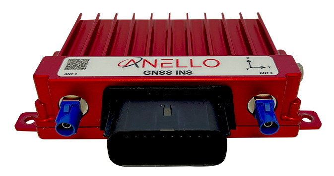
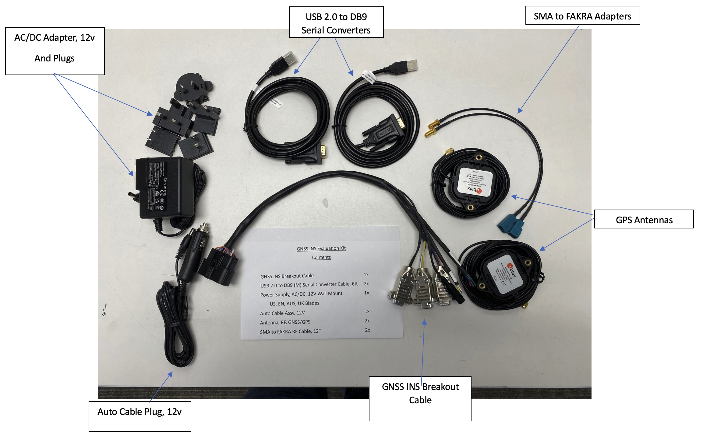
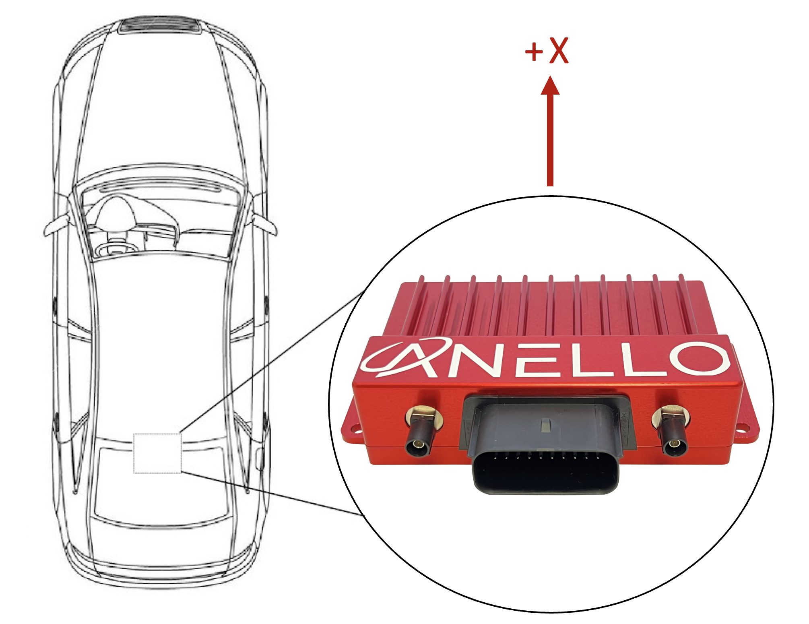

==================================
GNSS INS Getting Started Guide
==================================
Thank you for choosing the ANELLO GNSS INS! This guide will get you started with connection, configuration and data collection.
Please contact support@anellophotonics.com with any questions.  

Hardware Connections
---------------------------------
The ANELLO GNSS INS unit is pictured below. It features a 20 pin automotive-grade Molex MX150 connector and two FAKRA SMB GNSS connectors.

If you received an ANELLO GNSS INS Loaner unit, you will also receive the Accessory Kit with the items pictured below. 
For GNSS INS purchases, the Accessory Kit is sold separately and more information is available upon request.

To use the GNSS INS Evaluation Kit, connect the hardware as follows: 

1. Connect breakout cable to GNSS INS unit
2. Connect to power using either the AC/DC adapter or the Auto Cable Plug.
3. Connect primary GNSS antenna to ANT1 using SMA to FAKRA Adapters. An additional antenna (ANT2) is optional and enables stationary dual heading.
4. Connect to computer via RS-232 using USB 2.0 to DB9 serial converters for configuration.
5. If you'd like to use the automotive ethernet interface, connection over serial is required first to configure IP addresses.

An SCD drawing of the GNSS INS and a schematic of the Accessory kit breakout cable can be found in 
`Mechanicals <https://docs-a1.readthedocs.io/en/latest/mechanicals.html#anello-gnss-ins>`__.

Software Interfaces
---------------------------------
ANELLO provides a Python tool to connect, configure, and log data with the GNSS INS.
Please see instructions on `ANELLO Python Tool <https://docs-a1.readthedocs.io/en/latest/python_tool.html>`__.

ANELLO units are also compatible with ROS using our C-based `ROS driver <https://github.com/Anello-Photonics/ANELLO_ROS_Driver>`_.

If you would like to connect to the GNSS INS using a serial interface software such as CoolTerm, 
please ensure you use the correct baud rate (default for the GNSS INS is 230400), and set Data Bits = 8, Stop Bits = 1, and Parity = None.

For a full list of software tools, please see `Software Tools <https://docs-a1.readthedocs.io/en/latest/software_tools.html>`_.

Configure ANELLO GNSS INS
---------------------------------
Before testing the ANELLO GNSS INS, please review the `Unit Configurations <https://docs-a1.readthedocs.io/en/latest/unit_configuration.html>`_,
and `Vehicle Configurations <https://docs-a1.readthedocs.io/en/latest/vehicle_configuration.html>`_ and ensure they are set according to your testing needs.

The easiest way to change configurations is using the `ANELLO Python Tool <https://docs-a1.readthedocs.io/en/latest/python_tool.html#set-anello-configurations>`__.
Select *Unit Configuration* from the main menu. The default configurations will appear, and you can select *Edit* to change a configuration.

You may also send configurations manually using the `#APCFG command <https://docs-a1.readthedocs.io/en/latest/communication_messaging.html#apcfg-messages>`_ 
over the GNSS INS configuration port (RS232-2) using a serial interface software such as CoolTerm.

.. note:: As of firmware v1.2.6, the antenna baseline must be calibrated to use dual antenna functionality. Please refer to `Vehicle Configurations <https://docs-a1.readthedocs.io/en/latest/vehicle_configuration.html>`_ to ensure all vehicle configurations are set properly.

Connect to NTRIP Caster
------------------------------
Standard RTCM messages can be forwarded to the ANELLO GNSS INS data port to enable the GNSS receivers to reach RTK-level accuracy. 
The GNSS INS receives standard RTCM3.3 in MSM format, including MSM4, MSM5, and MSM7 messages. 

The ANELLO Python Program also provides an NTRIP client which can connect to a standard NTRIP network and forward the received RTCM messages into the GNSS INS.

From the main menu, select *NTRIP* and then *Start*. Enter the NTRIP caster details as prompted. 
The *System Status* will show the NTRIP connection status.

Vehicle Installation
----------------------------
The GNSS INS can be configured for various installation positions. To minimize configuration steps, 
mount near the center of the vehicle’s rear axle, with the x-axis facing the direction of travel.

The GNSS antennae can be magnetically mounted on the roof of the vehicle.

Data Collection & Visualization
------------------------------------

Log Data
~~~~~~~~~~~~~~~~~
The ANELLO Python Tool can be used to `log data <https://docs-a1.readthedocs.io/en/latest/python_tool.html#data-collection>`__ from the ANELLO GNSS INS
by selecting *Log* in the main menu. Alternatively, you may use the ANELLO ROS driver or another program of your choice to log data. 

Monitor Data Output
~~~~~~~~~~~~~~~~~~~~~~~~~~~~~~~~~~~
The ANELLO Python Tool can be used to `monitor data <https://docs-a1.readthedocs.io/en/latest/python_tool.html#monitor-output>`__ 
from the ANELLO GNSS INS in real-time by selecting *Monitor* in the main menu.

Data Visualization
~~~~~~~~~~~~~~~~~~~~~~~~~~~~~~~~~~~
The INS solution can be visualized by importing ins.csv into `Kepler <https://kepler.gl/demo>`_.
You may also use a `CSV to KML converter <https://www.convertcsv.com/csv-to-kml.htm>`_ to visualize the results in Google Earth, 
but note that these tools often have data length limitations.

Drive Testing
-------------------
Before conducting drive testing, please review `Drive Testing Best Practices <https://docs-a1.readthedocs.io/en/latest/drive_testing.html>`_ 
to ensure the system is set up properly, initializes smoothly, and is optimized for your use case.

**Congratulations!!!**
You have completed the GNSS INS setup and data collection! Please feel free to contact support@anellophotonics.com with any questions. 