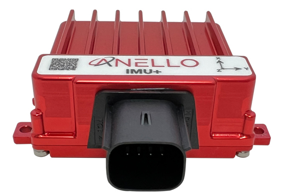
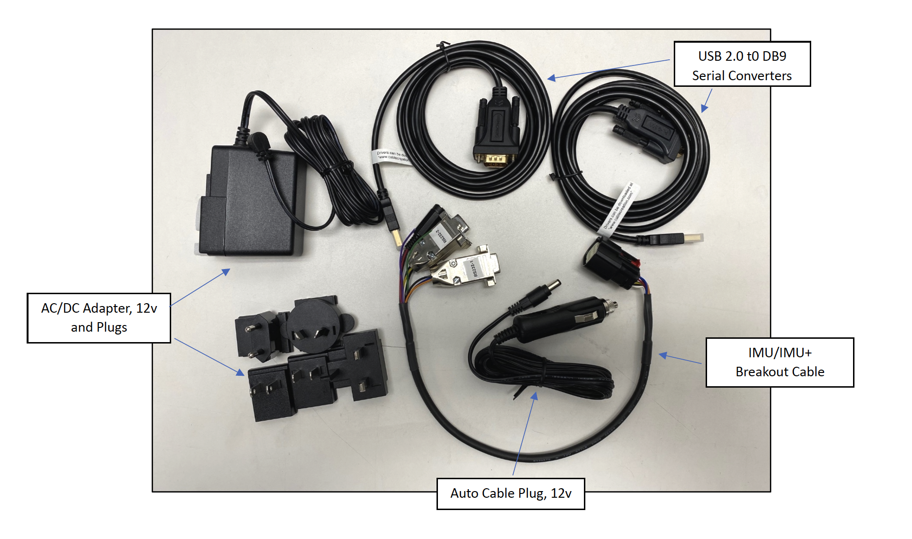

==================================
Ground IMU Getting Started Guide
==================================
Thank you for choosing the ANELLO Ground IMU! This step-by-step guide will get you started with connection, configuration and data collection.
Please contact support@anellophotonics.com with any questions.  

1. Hardware Connections
---------------------------------
The ANELLO IMU/Ground IMU unit is pictured below. It features an 8 pin automotive-grade Molex MX150 connector.

If you received an ANELLO Ground IMU Loaner unit, you will also receive the Accessory Kit with the items pictured below. 
For Ground IMU purchases, the Accessory Kit is sold separately and more information is available upon request.

To use the IMU Evaluation Kit, connect the hardware as follows:

a. Connect breakout cable to IMU unit. 
b. Connect to power using the AC/DC adapter. 
c. Connect to PC, Mac, or Ubuntu computing system via RS-232 using USB 2.0 to DB9 Serial Converters. 

An SCD drawing of the Ground IMU and a schematic of the Accessory kit breakout cable can be found in 
`Mechanicals <https://docs-a1.readthedocs.io/en/latest/mechanicals.html#anello-imu-imu>`__.

2. Software Interfaces
---------------------------------
ANELLO provides a Python tool to connect, configure, and log data with the ANELLO IMU.
Please see instructions on `ANELLO Python Tool <https://docs-a1.readthedocs.io/en/latest/python_tool.html>`__ to install and run the Python tool.
Be sure to run "git pull" regularly to make sure you are using the latest Python tool updates.

ANELLO units are also compatible with ROS using our C-based `ROS driver <https://github.com/Anello-Photonics/ANELLO_ROS_Driver>`_.

If you would like to connect to the IMU using a serial interface software such as CoolTerm, 
please ensure you use the correct baud rate **(default for the IMU is 230400), and set Data Bits = 8, Stop Bits = 1, and Parity = None.**

More information on the Ground IMU interfacing can be found under under `Communication and Messaging <https://docs-a1.readthedocs.io/en/latest/communication_messaging.html>`__.

For a full list of software tools, please see `Software Tools <https://docs-a1.readthedocs.io/en/latest/software_tools.html>`_.

3. Configure ANELLO Ground IMU 
---------------------------------
Before testing your IMU, please review the `Unit Configurations <https://docs-a1.readthedocs.io/en/latest/unit_configuration.html>`_ 
and ensure they are set according to your testing needs.

The easiest way to change configurations is using the `ANELLO Python Tool <https://docs-a1.readthedocs.io/en/latest/python_tool.html#set-anello-configurations>`__.
Select *Unit Configuration* from the main menu. The default configurations will appear, and you can select *Edit* to change a configuration.

You may also send configurations manually using the `#APCFG command <https://docs-a1.readthedocs.io/en/latest/communication_messaging.html#apcfg-messages>`_ 
over the IMU's configuration port using a serial interface software such as CoolTerm.

4. Data Collection
----------------------------

The Ground IMU message format is found under under `Communication and Messaging <https://docs-a1.readthedocs.io/en/latest/communication_messaging.html#imu-message-imu-imu>`_.

a. Log Data
~~~~~~~~~~~~~~~~~
ANELLO provides the following tools for logging:

1. ANELLO `Python tool <https://docs-a1.readthedocs.io/en/latest/python_tool.html#data-collection>`__, by selecting *Log* in the main menu, OR
2. ANELLO `ROS driver <https://github.com/Anello-Photonics/ANELLO_ROS_Driver>`__

b. Monitor Data Output
~~~~~~~~~~~~~~~~~~~~~~~~~~~~~~~~~~~
The ANELLO Python Tool can be used to `monitor data <https://docs-a1.readthedocs.io/en/latest/python_tool.html#monitor-output>`__ 
from the ANELLO IMU in real-time by selecting *Monitor* in the main menu.

5. ANELLO AHRS Solution
-------------------------------
Available as an upgrade for the ANELLO Ground IMU is the ANELLO AHRS Solution which provides the roll, pitch and yaw angles calculated as standard aerospace Euler angles in a 3-2-1 (yaw, pitch, roll) body frame rotation at a fixed 100 Hz output data rate.
Please note that the yaw is not an absolute heading but an integrated relative heading - unless an absolute heading is provided by the user, after which the optical gyro integrates relative to that absolute heading.
Information for configurations can be found in the `Unit Configurations <https://docs-a1.readthedocs.io/en/latest/unit_configuration.html>`_  and message structures can be found in
`Communication and Messaging <https://docs-a1.readthedocs.io/en/latest/communication_messaging.html>`__.

**Congratulations!!!**
You have completed the IMU setup! Please contact support@anellophotonics.com with any questions. 

Note: This device complies with FCC Part 15 standards. Operation is subject to the following two conditions: 
(1) This device may not cause harmful interference, and 
(2) this device must accept any interference received, including interference that may cause undesired operation.

*Ground IMU User Manual 93001301 v1.0.0*