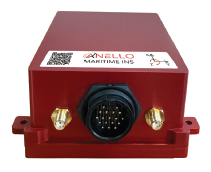
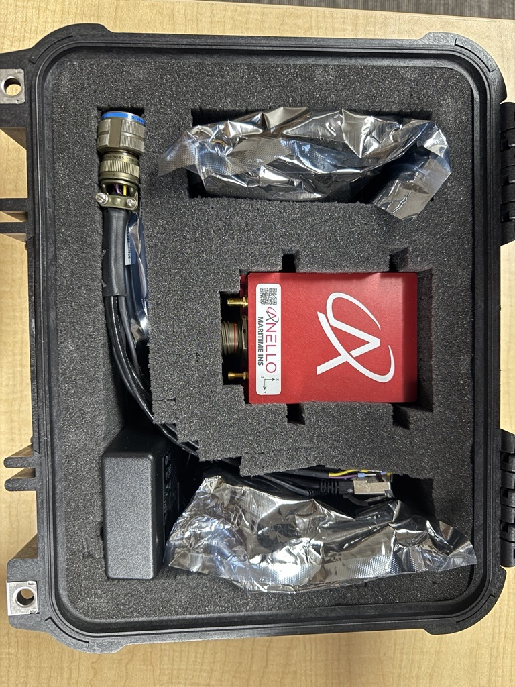
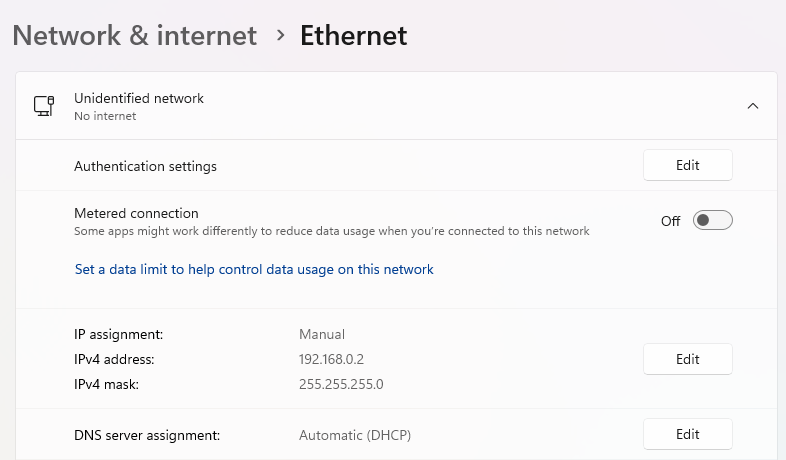
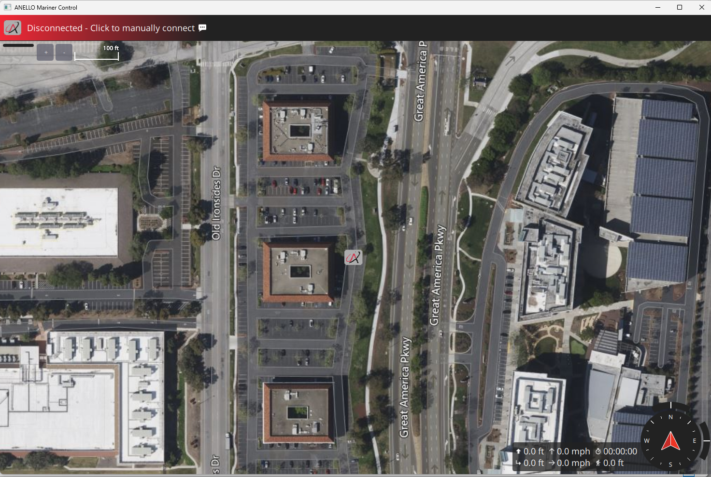
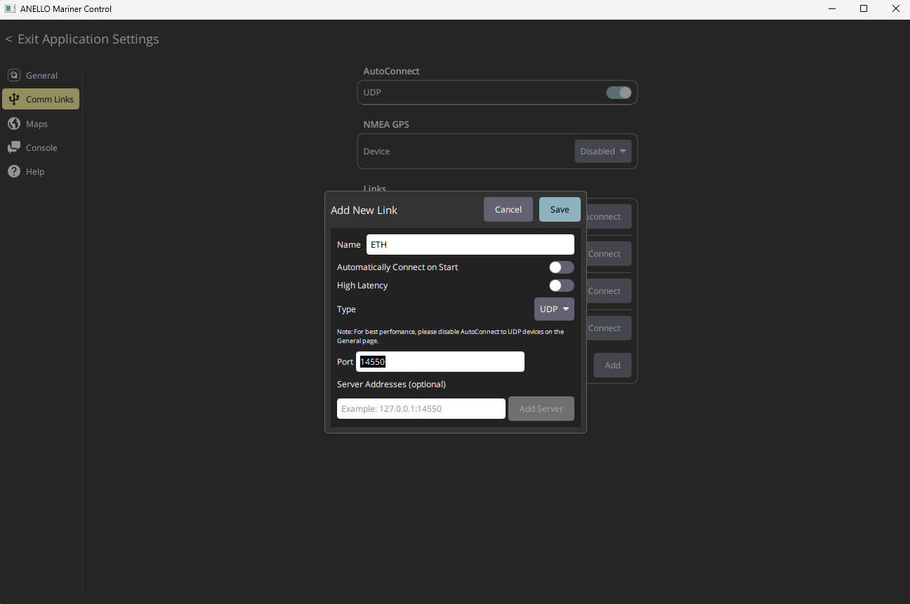
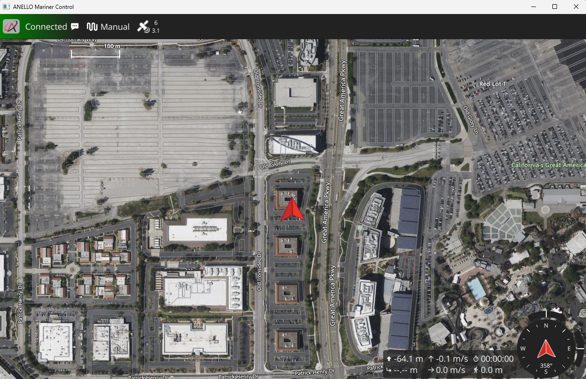
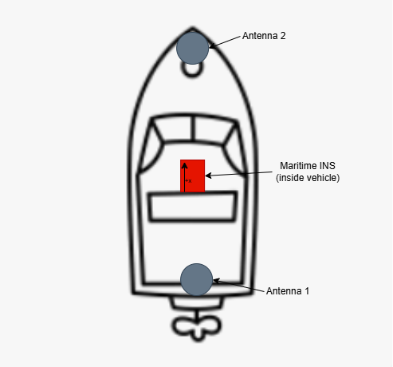
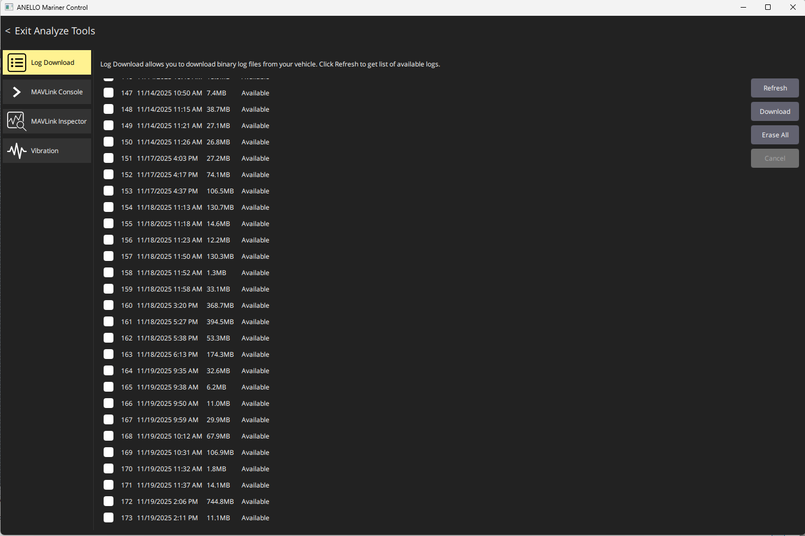

==================================
Maritime INS Getting Started Guide
==================================

Thank you for choosing the ANELLO Maritime INS! This step-by-step guide will get you started with connection, configuration, and data collection.  
Please contact support@anellophotonics.com with any questions.  

1. Hardware Connections
---------------------------------

The ANELLO Maritime INS unit is pictured below. It features a 22-pin circular connector and two female SMA GNSS connectors.

An SCD drawing of the Maritime INS and a schematic of the accessory kit breakout cable can be found in  
`Mechanicals <https://docs-a1.readthedocs.io/en/maritime_ins/mechanicals.html>`__.

If you received an ANELLO Maritime INS Loaner unit, you will also receive the Accessory Kit pictured below. 

The kit includes the following hardware:
   a. 22 pin MIL-DTL-38999 circular breakout connector for connecting to the Maritime INS
   b. 2 Triple frequency GNSS antennae
   c. 2 USB to serial FTDI chipset adapter cables
   d. Ethernet to USB adapter cable
   e. 12V AC/DC barrel jack wall plug adapter

2. Software Interfaces
---------------------------------

Connect with the ANELLO Maritime Control software (AMarinerControl):

1. Install ANELLO's `AMarinerControl <https://github.com/Anello-Photonics/amarinercontrol/releases/download/v1.0.2/AMarinerControl-Setup.exe>`_ on your Windows computer. For MacOS and Linux support contact support@anellophotonics.com.

2. Set the Ethernet IP address of the host computer to **192.168.0.2** and subnet mask to **255.255.255.0**.

3. Open AMarinerControl.

4. Set up the Ethernet connection in AMarinerControl (only needs to be done once):

   a. Click the **A** button (top left) → Application Settings → Comm Links → Add New Link  
   b. Name: ETH
   c. Type: UDP  
   d. Port: 14550

   You can also check "Automatically Connect on Start" to automatically use these comm link settings to connect to the Maritime INS every time the application is opened.

5. Connect the Maritime INS to the computer using Ethernet.

6. Once connected, the status in the top left of AMarinerControl changes from **Disconnected** to **Connected**.

3. Vehicle Installation
----------------------------

The ANELLO Maritime INS can be configured for various installation positions as long as parameters are set as detailed in the next section.  
An external speed-aiding sensor, e.g. paddle wheel, ultrasonic sensor, Doppler velocity log (DVL), is highly recommended to maintain accuracy in GPS-denied conditions. 
Calibration procedures for common sensors are detailed in  
`Sensor Calibrations <https://docs-a1.readthedocs.io/en/maritime_ins/sensor_calibrations.html>`__.

It is recommended that the Maritime INS be installed with the **X axis facing forward** and as close to the centerline as possible.  
If this is not possible, configure **SENS_BOARD_ROT** and **EKF2_IMU_POS_...** offsets accordingly.

Below is the recommended installation configuration, with the longest possible antenna baseline (distance between antennae). A minimum of a 1 meter baseline is required to ensure optimal dual antenna heading accuracy.

Ensure that antennae are mounted on a ground plane of at least 10 cm x 10 cm and with no obstructions to open sky view.

4. Configure ANELLO Maritime INS
---------------------------------

The lever arms of the installation must be measured and configured as parameters to ensure accuracy.  
The coordinate system follows the right-hand rule: **X = forward**, **Y = right**, **Z = down**.  
The INS center is the center of the Maritime INS unit.

Distances are measured in meters from the IMU center to the respective antenna phase center.

+---------------------+-------+---------+-----------------------------------------------------------------------------------------+
| Parameter           | Units | Default | Description                                                                             |
+=====================+=======+=========+=========================================================================================+
| **GPS_SEP_BASE_X**  | m     | 0       | X offset from INS center to Base antenna (ANT1).                                        |
+---------------------+-------+---------+-----------------------------------------------------------------------------------------+
| **GPS_SEP_BASE_Y**  | m     | 0       | Y offset from INS center to Base antenna (ANT1).                                        |
+---------------------+-------+---------+-----------------------------------------------------------------------------------------+
| **GPS_SEP_BASE_Z**  | m     | 0       | Z offset from INS center to Base antenna (ANT1).                                        |
+---------------------+-------+---------+-----------------------------------------------------------------------------------------+
| **GPS_SEP_ROVER_X** | m     | 0       | X offset from INS center to Rover antenna (ANT2).                                       |
+---------------------+-------+---------+-----------------------------------------------------------------------------------------+
| **GPS_SEP_ROVER_Y** | m     | 0       | Y offset from INS center to Rover antenna (ANT2).                                       |
+---------------------+-------+---------+-----------------------------------------------------------------------------------------+
| **GPS_SEP_ROVER_Z** | m     | 0       | Z offset from INS center to Rover antenna (ANT2).                                       |
+---------------------+-------+---------+-----------------------------------------------------------------------------------------+
| **EKF2_IMU_POS_X**  | m     | 0       | X offset from center of boat to INS center.                                             |
+---------------------+-------+---------+-----------------------------------------------------------------------------------------+
| **EKF2_IMU_POS_Y**  | m     | 0       | Y offset from center of boat to INS center.                                             |
+---------------------+-------+---------+-----------------------------------------------------------------------------------------+
| **EKF2_IMU_POS_Z**  | m     | 0       | Z offset from center of boat to INS center.                                             |
+---------------------+-------+---------+-----------------------------------------------------------------------------------------+
| **SENS_BOARD_ROT**  | enum  | 0       | INS mounting orientation. Set this if unit is not mounted with X-forward.               |
|                     |       |         |                                                                                         |
|                     |       |         | *Common values:*                                                                        |
|                     |       |         |   - **No Rotation**: Unit mounted upright with X pointing in vehicle forward            |
|                     |       |         |   - **Yaw 90°**: Unit mounted upright with X pointing in vehicle right                  |
|                     |       |         |   - **Yaw 180°**: Unit mounted upright with X pointing in vehicle back                  |
|                     |       |         |   - **Yaw 270°**: Unit mounted upright with X pointing in vehicle left                  |
|                     |       |         |   - **Roll 180°**: Unit mounted upside down with X pointing in vehicle forward          |
|                     |       |         |   - **Roll 180°, Yaw 90°**: Unit mounted upside down with X pointing in vehicle right   |
|                     |       |         |   - **Roll 180°, Yaw 180°**: Unit mounted upside down with X pointing in vehicle back   |
|                     |       |         |   - **Roll 180°, Yaw 270°**: Unit mounted upside down with X pointing in vehicle left   |
|                     |       |         |                                                                                         |
|                     |       |         | Will be presented as a drop-down menu in AMarinerControl.                               |
+---------------------+-------+---------+-----------------------------------------------------------------------------------------+

Parameters can be changed using

   1. AMC

      To change parameters using AMarinerControl: **A > Parameters**

      .. image:: media/AMC_parameters.png
         :width: 70%
         :align: center

   2. Python scripts from the ANELLO INS Scripts public repository: `Maritime_INS_CFG.py (ANELLO INS Scripts) <https://github.com/Anello-Photonics/ANELLO_INS_Scripts/blob/main/Maritime_INS_CFG.py>`_
 

.. note:: For best results, it is recommended that antenna lever arms be centimeter accurate as these are used to calculate any offsets for dual antenna heading measurements.

NMEA 2000 Output Rate Parameters
~~~~~~~~~~~~~~~~~~~~~~~~~~~~~~~~

To enable the NMEA 2000 driver, ensure the parameter ``NM2K_CFG`` is set to 1. Then, each published PGN has an associated output data rate parameter in the
**NM2K** group (e.g. ``NM2K_129025_RATE``, ``NM2K_129026_RATE``,
``NM2K_129029_RATE``). Rates are specified in Hertz and are clamped between
``0`` and ``100``. Setting a value to ``0`` stops transmission of that PGN; any
positive value defines the broadcast frequency. Update the rates from
AMarinerControl's parameter editor or from the command-line interface.

Ethernet Parameters
~~~~~~~~~~~~~~~~~~~~~~~~~~~~~~
Ethernet settings can be configured using the following parameters:

+---------------------+--------------------------+--------------------+-----------------------------------------------------------------------------------------+
| Parameter           | Default (human readable) | Default (int32)    | Description                                                                             |
+=====================+==========================+====================+=========================================================================================+
| **NET_CFG_PROTO**   | DEVICE=eth0              | 1                  | Network device interface name.                                                          |
+---------------------+--------------------------+--------------------+-----------------------------------------------------------------------------------------+
| **NET_CFG_NETMASK** | NETMASK=255.255.255.0    | -256               | Network subnet mask.                                                                    |
+---------------------+--------------------------+--------------------+-----------------------------------------------------------------------------------------+
| **NET_CFG_IPADDR**  | IPADDR=192.168.0.3       | -1062731773        | Static IP address assigned to the interface.                                            |
+---------------------+--------------------------+--------------------+-----------------------------------------------------------------------------------------+
| **NET_CFG_ROUTER**  | ROUTER=192.168.0.254     | -1062731522        | Default gateway (router) for the network.                                               |
+---------------------+--------------------------+--------------------+-----------------------------------------------------------------------------------------+
| **NET_CFG_DNS**     | DNS=192.168.0.254        | -1062731522        | DNS server address.                                                                     |
+---------------------+--------------------------+--------------------+-----------------------------------------------------------------------------------------+
| MAV_2_UDP_PRT       | 14550                    | 14550              | MAVLink UDP port number (INS side)                                                      |
+---------------------+--------------------------+--------------------+-----------------------------------------------------------------------------------------+
| MAV_2_REMOTE_PRT    | 14550                    | 14550              | MAVLink UDP remote port number (PC side)                                                |
+---------------------+--------------------------+--------------------+-----------------------------------------------------------------------------------------+

Ethernet IPv4 Parameter Encoding
""""""""""""""""""""""""""""""""""

Ethernet configuration parameters (IP address, netmask, router, DNS) are stored
internally as **signed 32-bit integers (int32)**, not as human-readable
IPv4 strings.

The following Python helper function converts a standard IPv4 string
(e.g. ``"192.168.0.3"``) into the signed int32 value used by the Ethernet
configuration parameters.

.. code-block:: python

    # ==================================================================================
    # IPv4 string → signed int32 conversion
    # ==================================================================================
    def ipv4_to_int32(ip_str):
        """
        Convert readable IPv4 like '192.168.0.2' into signed 32-bit integer
        """
        parts = ip_str.split('.')
        if len(parts) != 4:
            raise ValueError("Invalid IPv4 address format: %s" % ip_str)

        a, b, c, d = [int(p) for p in parts]

        unsigned32 = (a << 24) | (b << 16) | (c << 8) | d

        # Convert to signed 32-bit
        if unsigned32 >= (1 << 31):
            signed32 = unsigned32 - (1 << 32)
        else:
            signed32 = unsigned32

        return signed32

The same logic is already implemented in the ANELLO INS Scripts repository: 
`Maritime_INS_CFG.py (ANELLO INS Scripts) <https://github.com/Anello-Photonics/ANELLO_INS_Scripts/blob/main/Maritime_INS_CFG.py>`_

Port number configs can be changed directly in AMC.

CAN Termination
~~~~~~~~~~~~~~~~~~~~~~~~~~~
The ANELLO Maritime INS supports configurable internal CAN termination.

+------------------+---------+-----------------------------------------------------------+
| Parameter        | Default | Description                                               |
+==================+=========+===========================================================+
| **CAN_TERM**     | 1       | CAN bus termination setting.                              |
|                  |         | **0** = No termination resistor.                          |
|                  |         | **1** = 120 Ω termination resistor enabled.               |
+------------------+---------+-----------------------------------------------------------+

.. note:: Configurable CAN termination supported for production units (P/N 10001301), not for evaluation units (P/N 10001302)

5. Data Collection & Visualization
------------------------------------

After installation and configuration, the unit is ready for data collection.  
Data is logged automatically once power is applied to the Maritime INS. No manual steps are required to start logging.

* Start a new log by cycling power to the unit.  
* Download logs in AMarinerControl under **A > Analyze Tools > Log Download**.  
* Use a plotting tool such as PlotJuggler for visualization. Contact ANELLO for assistance with post-processing, including GPS-denied simulations.

Some key topics in the log files are:

+-------------------------------+----------------------------------------------------------------------------------------------------+
| Topic                         | Description                                                                                        |
+===============================+====================================================================================================+
| **vehicle_global_position**   | Full INS solution containing latitude longitude coordinates                                        |
+-------------------------------+----------------------------------------------------------------------------------------------------+
| **sensor_gps.01**             | GNSS only solution from BASE receiver.                                                             |
+-------------------------------+----------------------------------------------------------------------------------------------------+
| **sensor_gps.00**             | GNSS only solution from ROVER receiver.                                                            |
+-------------------------------+----------------------------------------------------------------------------------------------------+
| **sensor_gps_heading**        | GNSS Dual heading and baseline data                                                                |
+-------------------------------+----------------------------------------------------------------------------------------------------+
| **sensor_water_speed_generic**| Speed aiding data from external sensor                                                             |
+-------------------------------+----------------------------------------------------------------------------------------------------+
| **nmea_engine**               | NMEA engine data from NMEA2000 bus                                                                 |
+-------------------------------+----------------------------------------------------------------------------------------------------+

6. Water Testing Procedure
-------------------------------

For best GPS-denied navigation results, ANELLO recommends the following initialization procedure after each startup:

1. Ensure the unit is powered off while launching the vehicle into the water.

2. While the USV is stationary in water, power on the unit. A good GPS signal is required for position initialization.

3. For best performance, first perform a short square mission with 30–50 m edges to give the system visibility into currents before GPS is lost.

4. Perform your mission. Best performance in GPS-denied conditions is achieved with calibrated speed aiding and at speeds above 2 knots.

*Maritime INS User Manual 93001501 v1.0.0*
