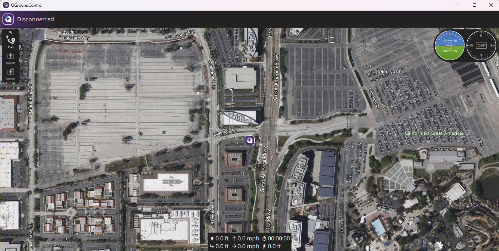
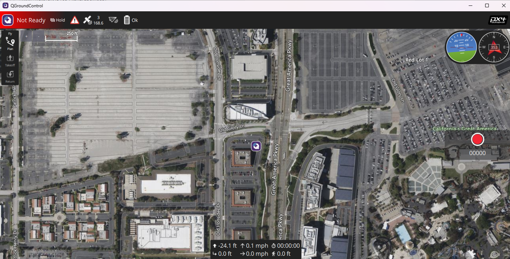
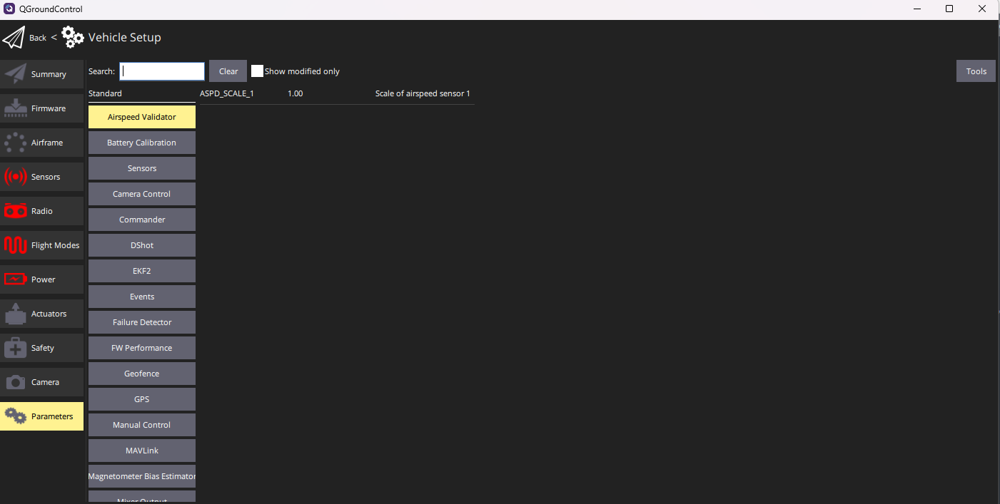
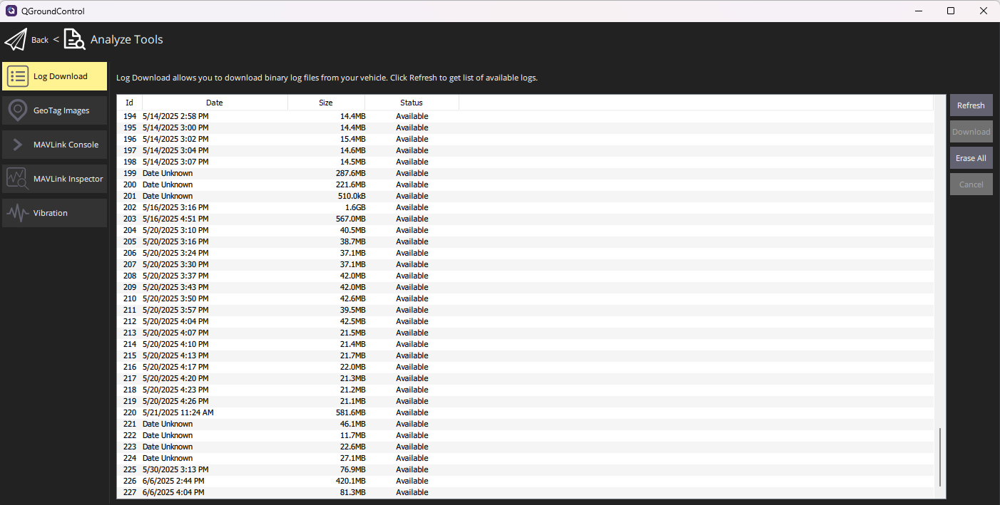

==================================
Maritime INS Getting Started Guide
==================================

Thank you for choosing the ANELLO Maritime INS! This step-by-step guide will get you started with connection, configuration and data collection.
Please contact support@anellophotonics.com with any questions.  

1. Hardware Connections
---------------------------------

The ANELLO Maritime INS unit is pictured below. It features a 20 pin circular connector and two female SMA GNSS connectors

.. image:: media/ANELLO_Maritime_INS.png
   :width: 20 %
   :align: center

An SCD drawing of the GNSS INS and a schematic of the Accessory kit breakout cable can be found in 
`Mechanicals <https://docs-a1.readthedocs.io/en/maritime_ins/mechanicals.html>`__.

2. Software Interfaces
---------------------------------

Connect with QGroundControl:

1. Install `QGroundControl <https://qgroundcontrol.com/>`_ software onto your laptop or computer 

2. Connect the Maritime INS to computer using ethernet breakout from 20 pin connector

3. Change ethernet IP address on host computer to "192.168.0.2" and subnet mask to "255.255.255.0"

.. image:: media/ethernet_settings.png
   :width: 60 %
   :align: center

4. Open QGroundControl. 

5. Set up ethernet connection in QGroundControl (only needs to be done once):
	a.	Click Q button (top right) -> Application Settings -> Comm Links -> ETH
	b.	Type: UDP
	c.	Port: 14550

6. Once connected, the text on the top left will change from “Disconnected” to “Not Ready” 

3. Vehicle Installation
----------------------------

The ANELLO Maritime INS can be configured for various installation positions as long as parameters are set as detailed in the next section.
An external speed aiding sensor is required to maintain accuracy in GPS denied conditions. Calibration procedures for common sensors are detailed in  `Sensor Calibrations <https://docs-a1.readthedocs.io/en/maritime_ins/sensor_calibrations.html>`_

It is recommended that the Maritime INS is installed with the X axis facing forward to vehicle front / direction of travel and as close to the centerline as possible. Otherwise SENS_BOARD and EKF2_IMU_POS offsets will need to be configured.

Below is the recommended installation configuration, with the longest possible antenna baseline (distance between antenna) to ensure maximum dual antenna heading accuracy.

.. image:: media/maritime_ins_installation.drawio.png
   :width: 60 %
   :align: center

4. Configure ANELLO Maritime INS
---------------------------------

The lever arms of the installation must be measured and configured as parameters in QGroundControl to ensure solution accuracy. The X, Y, Z directions follow the right-hand rule: **X = forward**, **Y = right**, **Z = down**. The IMU center is the center of the red Maritime INS unit.

Most important parameters are bolded. Distances are measured in feet from the IMU center to the respective antenna phase center.

+------------------------------+--------+---------+-----------------------------------------------------------------------------------------------+
| Parameter                    | Units  | Default | Description                                                                                   |
+==============================+========+=========+===============================================================================================+
| **GPS_SEP_ROVER_X**          | m      | 0       | X offset from IMU center to **Rover antenna (ANT2)**                                          |
+------------------------------+--------+---------+-----------------------------------------------------------------------------------------------+
| **GPS_SEP_ROVER_Y**          | m      | 0       | Y offset from IMU center to Rover antenna (ANT2)                                              |
+------------------------------+--------+---------+-----------------------------------------------------------------------------------------------+
| GPS_SEP_ROVER_Z              | m      | 0       | Z offset from IMU center to Rover antenna (ANT2)                                              |
+------------------------------+--------+---------+-----------------------------------------------------------------------------------------------+
| **GPS_SEP_BASE_X**           | m      | 0       | X offset from IMU center to **Base antenna (ANT1)**                                           |
+------------------------------+--------+---------+-----------------------------------------------------------------------------------------------+
| **GPS_SEP_BASE_Y**           | m      | 0       | Y offset from IMU center to Base antenna (ANT1)                                               |
+------------------------------+--------+---------+-----------------------------------------------------------------------------------------------+
| GPS_SEP_BASE_Z               | m      | 0       | Z offset from IMU center to Base antenna (ANT1)                                               |
+------------------------------+--------+---------+-----------------------------------------------------------------------------------------------+
| **GPS_YAW_OFFSET**           | deg    | 0       | Yaw offset to align antenna heading with vessel heading; typically set to align coordinate    |
|                              |        |         | frames                                                                                        |
+------------------------------+--------+---------+-----------------------------------------------------------------------------------------------+
| **EKF2_GPS_POS_X**           | ft     | 0       | X offset from IMU center to Rover antenna (ANT2)                                              |
+------------------------------+--------+---------+-----------------------------------------------------------------------------------------------+
| **EKF2_GPS_POS_Y**           | ft     | 0       | Y offset from IMU center to Rover antenna (ANT2)                                              |
+------------------------------+--------+---------+-----------------------------------------------------------------------------------------------+
| EKF2_GPS_POS_Z               | ft     | 0       | Z offset from IMU center to Rover antenna (ANT2)                                              |
+------------------------------+--------+---------+-----------------------------------------------------------------------------------------------+
| **EKF2_GPS_BSL**             | ft     | 0       | Baseline length (distance) between Base (ANT1) and Rover (ANT2) antennas                      |
+------------------------------+--------+---------+-----------------------------------------------------------------------------------------------+
| **EKF2_IMU_POS_X**           | ft     | 0       | X offset from center of boat to IMU center                                                    |
+------------------------------+--------+---------+-----------------------------------------------------------------------------------------------+
| **EKF2_IMU_POS_Y**           | ft     | 0       | Y offset from center of boat to IMU center                                                    |
+------------------------------+--------+---------+-----------------------------------------------------------------------------------------------+
| EKF2_IMU_POS_Z               | ft     | 0       | Z offset from center of boat to IMU center                                                    |
+------------------------------+--------+---------+-----------------------------------------------------------------------------------------------+
| **SENS_BOARD_ROT**           | enum   | 0       | IMU/INS mounting orientation. Set this if the red box is not mounted with X-forward.          |
|                              |        |         |                                                                                               |
|                              |        |         | *Common values:*                                                                              |
|                              |        |         | - ``0`` No rotation (X forward, Y right, Z down)                                              |
|                              |        |         | - ``4`` Yaw 180° (box facing backwards)                                                       |
|                              |        |         | - ``6`` Yaw 270° (box rotated left)                                                           |
|                              |        |         | - ``2`` Yaw 90° (box rotated right)                                                           |
|                              |        |         | - ``12`` Pitch 180° (flipped upside down)                                                     |
|                              |        |         |                                                                                               |
|                              |        |         | Will be presented as drop down menu in QGroundControl                                         |
+------------------------------+--------+---------+-----------------------------------------------------------------------------------------------+

In QGroundControl: **Q > Vehicle Setup > Parameters**

5. Data Collection & Visualization
------------------------------------

After installing the box and configuring the units, you are ready for data collection. Data from the Maritime INS is logged automatically once power is applied to the box. There is no manual intervention needed to start a log. A couple notes: 

* A new log can be started simply by cycling power to the ANELLO payload. 

* Logs must be started in good GPS conditions, as GPS is currently used for global position initialization. 

* Logs can be downloaded in QGroundControl under Q > Analyze Tools > Log Download

6. Water Testing Procedure
-------------------------------

For best GPS-denied navigation results, ANELLO recommends the following initialization procedure after each startup: 

	1. ANELLO payload should be off while USV is launched into water. 

	2. While the USV is stationary in water with GPS signal, power on ANELLO payload. 

		a. Good GPS signal is currently required for initialization. 

		b. If you don’t see RMC output from the ANELLO unit, the system is not initialized yet. In good GPS conditions this typically takes less than 30 seconds. 

	3. Once you see data from ANELLO unit, the USV may start driving. Perform a short square mission with 30-50 meter edges to gain visibility into currents before GPS is lost. 

		a. This gives the system visibility into the sea currents and winds 

	4. After the square, you can perform your desired mission. Best GPS-denied performance is seen at speeds higher than 2 knots. 

		a. It is best to avoid driving backwards while GPS-denied for more than 10s at a time as paddle wheel behavior tends to be erratic during backwards driving. 

		b. To ensure ANELLO will be able to view the data in the log, it is recommended to keep the ANELLO system on only up to 5 hours at a time. (The ANELLO system will continue functioning and outputting messages beyond this time, but data will not be logged after this time.) 

	5. After completing mission, logs can be downloaded 

*Maritime INS User Manual 93001501 v1.0.0*