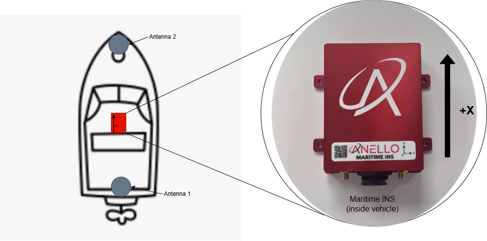

==================================
Maritime INS Getting Started Guide
==================================

Thank you for choosing the ANELLO Maritime INS! This step-by-step guide will get you started with connection, configuration, and data collection.
Please contact support@anellophotonics.com with any questions.  

1. Hardware Connections
-----------------------

The ANELLO Maritime INS unit is pictured below. It features a 20-pin circular connector and two female SMA GNSS connectors.

.. image:: media/ANELLO_Maritime_INS.png
   :width: 50%
   :align: center

An SCD drawing of the Maritime INS and a schematic of the accessory kit breakout cable can be found in 
`Mechanicals <https://docs-a1.readthedocs.io/en/maritime_ins/mechanicals.html>`__.

2. Software Interfaces
----------------------

Connect with QGroundControl:

1. Install `QGroundControl <https://qgroundcontrol.com/>`_ on your computer.

2. Set the Ethernet IP address of the host computer to **192.168.0.2** and subnet mask to **255.255.255.0**.

.. image:: media/ethernet_settings.png
   :width: 60%
   :align: center

3. Open QGroundControl. 

4. Set up the Ethernet connection in QGroundControl (only needs to be done once):  
   a. Click the **Q** button (top right) → Application Settings → Comm Links → ETH  
   b. Type: UDP  
   c. Port: 14550

5. Connect the Maritime INS to the computer using Ethernet.

6. Once connected, the status in the top left of QGroundControl changes from **Disconnected** to **Not Ready**.

.. image:: media/QGroundControl-NotReady.png
   :width: 60%
   :align: center

3. Vehicle Installation
-----------------------

The ANELLO Maritime INS can be installed in various orientations, provided parameters are set as described in the next section.  
For best performance in GPS-denied conditions, use an external speed-aiding sensor. Calibration procedures for common sensors are provided in  
`Sensor Calibrations <https://docs-a1.readthedocs.io/en/maritime_ins/sensor_calibrations.html>`__.

It is recommended to install the INS with the **X axis facing forward** and as close to the centerline as possible.  
If this is not possible, configure **SENS_BOARD_ROT** and **EKF2_IMU_POS** offsets accordingly.

Below is the recommended installation, with the longest possible antenna baseline (distance between antennas) for maximum heading accuracy.

4. Configure ANELLO Maritime INS
--------------------------------

The lever arms of the installation must be measured and entered as parameters in QGroundControl.  
The coordinate system follows the right-hand rule: **X = forward**, **Y = right**, **Z = down**.  
The IMU center is the geometric center of the red Maritime INS unit.

Distances are measured in **meters** from the IMU center to the antenna phase centers.

+---------------------+-------+---------+-----------------------------------------------------------------------------------+
| Parameter           | Units | Default | Description                                                                       |
+=====================+=======+=========+===================================================================================+
| **GPS_SEP_ROVER_X** | m     | 0       | X offset from IMU center to Rover antenna (ANT2).                                 |
+---------------------+-------+---------+-----------------------------------------------------------------------------------+
| **GPS_SEP_ROVER_Y** | m     | 0       | Y offset from IMU center to Rover antenna (ANT2).                                 |
+---------------------+-------+---------+-----------------------------------------------------------------------------------+
| **GPS_SEP_ROVER_Z** | m     | 0       | Z offset from IMU center to Rover antenna (ANT2).                                 |
+---------------------+-------+---------+-----------------------------------------------------------------------------------+
| **GPS_SEP_BASE_X**  | m     | 0       | X offset from IMU center to Base antenna (ANT1).                                  |
+---------------------+-------+---------+-----------------------------------------------------------------------------------+
| **GPS_SEP_BASE_Y**  | m     | 0       | Y offset from IMU center to Base antenna (ANT1).                                  |
+---------------------+-------+---------+-----------------------------------------------------------------------------------+
| **GPS_SEP_BASE_Z**  | m     | 0       | Z offset from IMU center to Base antenna (ANT1).                                  |
+---------------------+-------+---------+-----------------------------------------------------------------------------------+
| **EKF2_GPS_YAW_OFF**| deg   | 0       | Yaw offset to align antenna heading with vessel heading;                          |
|                     |       |         | typically set to align coordinate frames.                                         |
+---------------------+-------+---------+-----------------------------------------------------------------------------------+
| **EKF2_IMU_POS_X**  | m     | 0       | X offset from center of boat to IMU center.                                       |
+---------------------+-------+---------+-----------------------------------------------------------------------------------+
| **EKF2_IMU_POS_Y**  | m     | 0       | Y offset from center of boat to IMU center.                                       |
+---------------------+-------+---------+-----------------------------------------------------------------------------------+
| **EKF2_IMU_POS_Z**  | m     | 0       | Z offset from center of boat to IMU center.                                       |
+---------------------+-------+---------+-----------------------------------------------------------------------------------+
| **SENS_BOARD_ROT**  | enum  | 0       | INS mounting orientation. Set this if the unit is not mounted with X-forward.     |
|                     |       |         |                                                                                   |
|                     |       |         | *Common values:*                                                                  |
|                     |       |         |   - **0**: Unit mounted upright with X pointing forward                           |
|                     |       |         |   - **2**: Unit mounted upright with X pointing left                              |
|                     |       |         |   - **4**: Unit mounted upright with X pointing back                              |
|                     |       |         |   - **6**: Unit mounted upright with X pointing right                             |
|                     |       |         |   - **12**: Unit mounted upside down with X pointing forward                      |
|                     |       |         |   - **14**: Unit mounted upside down with X pointing right                        |
|                     |       |         |   - **16**: Unit mounted upside down with X pointing back                         |
|                     |       |         |   - **18**: Unit mounted upside down with X pointing left                         |
|                     |       |         |                                                                                   |
|                     |       |         | Will be presented as a drop-down menu in QGroundControl.                          |
+---------------------+-------+---------+-----------------------------------------------------------------------------------+

In QGroundControl: **Q → Vehicle Setup → Parameters**

5. Data Collection & Visualization
----------------------------------

After installation and configuration, the unit is ready for data collection.  
Data is logged automatically once power is applied to the Maritime INS. No manual steps are required to start logging.

* Start a new log by cycling power to the unit.  
* Download logs in QGroundControl: **Q → Analyze Tools → Log Download**.  
* Use a plotting tool such as PlotJuggler for visualization. Contact ANELLO for assistance with post-processing, including GPS-denied simulations.

6. Water Testing Procedure
--------------------------

For best GPS-denied navigation results, follow this initialization procedure after each startup:

1. Ensure the unit is powered off while launching the vehicle into the water.  
2. Once stationary, power on the unit. A good GPS signal is required for position initialization.  
3. For best performance, first perform a short square mission with 30–50 m edges to give the system visibility into currents before GPS loss.  
4. Perform your mission. Best performance in GPS-denied conditions is achieved with calibrated speed aiding at speeds above 2 knots.

*Maritime INS User Manual 93001501 v1.0.0*