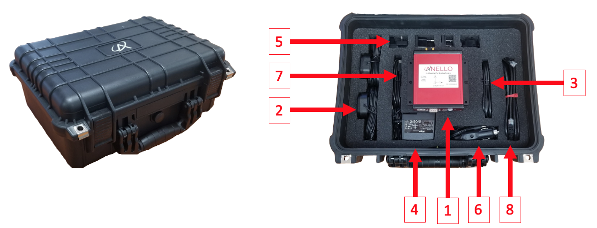
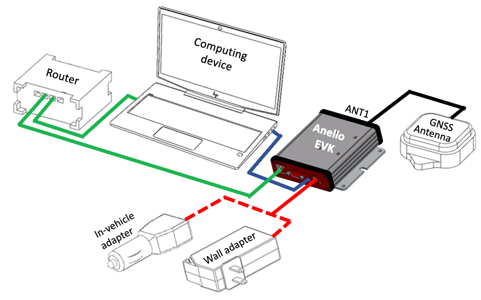
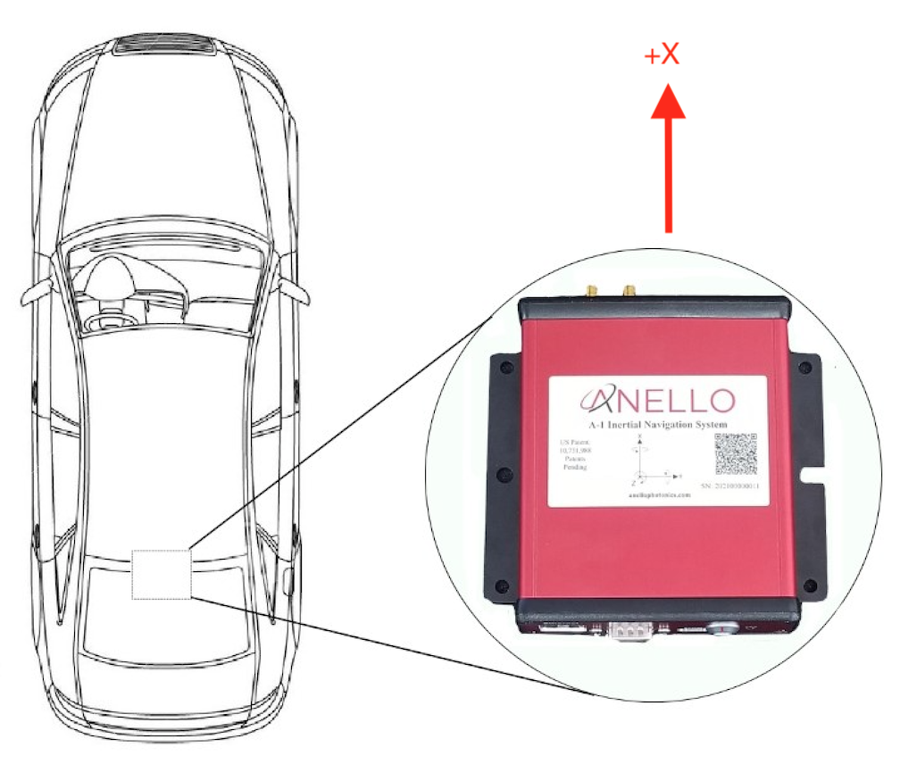

==================================
EVK Getting Started Guide
==================================
Thank you for choosing the ANELLO EVK! This step-by-step guide will get you started with EVK connection, configuration and data collection.
Please contact support@anellophotonics.com with any questions.  

1. Hardware Connections
---------------------------------
The ANELLO Evaluation Kit (EVK) includes the following items:

    +---+------------------------------------------------+
    | 1 | ANELLO EVK                                     |
    +---+------------------------------------------------+
    | 2 | Two Dual-Band Multi-Constellation GNSS Antennae|
    +---+------------------------------------------------+
    | 3 | Power Cable                                    |
    +---+------------------------------------------------+
    | 4 | 110-240V AC Wall-Power Adapter                 |
    +---+------------------------------------------------+
    | 5 | International Wall-Power Plug Inserts          |
    +---+------------------------------------------------+
    | 6 | In-Vehicle Power Adapter                       |
    +---+------------------------------------------------+
    | 7 | USB Cable                                      |
    +---+------------------------------------------------+
    | 8 | Ethernet Cable                                 |
    +---+------------------------------------------------+

Connect the hardware as follows: 

a. Connect EVK to power using either the wall-power or the in-vehicle adapter (red).
b. Connect EVK to computer using USB-C (blue). Ethernet interface (green) is also available, either directly to the computer or through a router, but connection over serial is required first to configure IP addresses.
c. Connect primary GNSS antenna to ANT1 on the back of the EVK (black). An optional additional antenna (ANT2) enables stationary heading initialization.

For more an SCD drawing of the EVK, see `Mechanicals <https://docs-a1.readthedocs.io/en/latest/mechanicals.html#anello-evk>`_.

2. Software Interfaces
---------------------------------
ANELLO provides a Python tool to connect, configure, and log data with the EVK.
Please see instructions on `ANELLO Python Tool <https://docs-a1.readthedocs.io/en/latest/python_tool.html>`__ to install and run the Python tool. 
Be sure to run "git pull" regularly to make sure you are using the latest Python tool updates.

ANELLO units are also compatible with ROS using our C-based `ROS driver <https://github.com/Anello-Photonics/ANELLO_ROS_Driver>`_.

If you would like to connect to the EVK using a serial interface software such as CoolTerm, 
please ensure you use the correct baud rate **(default for the EVK is 921600), and set Data Bits = 8, Stop Bits = 1, and Parity = None.**

For a full list of software tools, please see `Software Tools <https://docs-a1.readthedocs.io/en/latest/software_tools.html>`_.

3. Vehicle Installation
----------------------------

The EVK can be configured for various installation positions. To minimize configuration steps, 
mount near the center of the vehicle’s rear axle, with the X-forward facing the direction of travel.

The GNSS antennae can be magnetically mounted on the roof of the vehicle. See `Antenna Mounting <https://docs-a1.readthedocs.io/en/latest/vehicle_configuration.html#antenna-mounting>`_
for requirements on antenna installation.

4. Configure ANELLO EVK
---------------------------------
Before testing the ANELLO GNSS INS, please review and set:

1. `Unit Configurations <https://docs-a1.readthedocs.io/en/latest/unit_configuration.html>`_: Common Unit Configurations which change between setups are `Orientation <https://docs-a1.readthedocs.io/en/latest/unit_configuration.html#unit-installation-orientation>`_, 
`Misalignment Angle <https://docs-a1.readthedocs.io/en/latest/unit_configuration.html#anello-unit-installation-misalignment>`_, and Odometer Units. If you would like to use the Ethernet interface, please turn on "Enable Ethernet Output" and set UDP-related configurations. 

2. `Vehicle Configurations <https://docs-a1.readthedocs.io/en/latest/vehicle_configuration.html>`_: All lever arm measurments and calibrations must be completed prior to drive testing.

The easiest way to change configurations is using the `ANELLO Python Tool <https://docs-a1.readthedocs.io/en/latest/python_tool.html#set-anello-configurations>`__.
Select *Unit Configuration* from the main menu. The default configurations will appear, and you can select *Edit* to change a configuration.

You may also send configurations manually using the `#APCFG command <https://docs-a1.readthedocs.io/en/latest/communication_messaging.html#apcfg-messages>`_ 
over the EVK's configuration port using a serial interface software such as CoolTerm. Note that the configuration port on the EVK is the highest of the four virtual COM ports 
(more information at `Comminication & Messaging <https://docs-a1.readthedocs.io/en/latest/communication_messaging.html>`_). 

.. note:: As of firmware v1.2.6, the antenna baseline must be calibrated to use dual antenna functionality. Please refer to `Vehicle Configurations <https://docs-a1.readthedocs.io/en/latest/vehicle_configuration.html>`_ to ensure all vehicle configurations are set properly.

5. Connect to NTRIP Caster
------------------------------
Standard RTCM messages can be forwarded to the ANELLO EVK data port to enable the GNSS receivers to reach RTK-level accuracy. 
The EVK receives standard RTCM3.3 in MSM format, including MSM4, MSM5, and MSM7 messages. 

The ANELLO Python Program also provides an NTRIP client which can connect to a standard NTRIP network and forward the received RTCM messages into the EVK.

From the Python tool main menu, select *NTRIP* and then *Start*. Enter the NTRIP caster details as prompted. 
The *System Status* will show the NTRIP connection status.

Corrections must be configured to the WGS84 coordinate frame. Our inertial navigation system assumes WGS84 as the reference coordinate system, and using a different coordinate frame may result in incorrect positioning and navigation data.

6. Data Collection & Visualization
------------------------------------

a. Log Data
~~~~~~~~~~~~~~~~~
ANELLO recommends logging data using either:
1. ANELLO `Python tool <https://docs-a1.readthedocs.io/en/latest/python_tool.html#data-collection>`__, by selecting *Log* in the main menu, OR
2. ANELLO `ROS driver <https://github.com/Anello-Photonics/ANELLO_ROS_Driver>`__

b. Monitor Data Output
~~~~~~~~~~~~~~~~~~~~~~~~~~~~~~~~~~~
The ANELLO Python Tool can be used to `monitor data <https://docs-a1.readthedocs.io/en/latest/python_tool.html#monitor-output>`__ 
from the ANELLO EVK in real-time by selecting *Monitor* in the main menu.

c. Data Visualization
~~~~~~~~~~~~~~~~~~~~~~~~~~~~~~~~~~~
The INS solution can be visualized by importing ins.csv into `Kepler <https://kepler.gl/demo>`_.
You may also use a `CSV to KML converter <https://www.convertcsv.com/csv-to-kml.htm>`_ to visualize the results in Google Earth, 
but note that these tools often have data length limitations.

7. Drive Testing
-------------------
Before conducting drive testing, please review `Drive Testing Best Practices <https://docs-a1.readthedocs.io/en/latest/drive_testing.html>`_ 
to ensure the system is set up properly, initializes correctly, and is optimized for your use case.

If you would like help from the ANELLO team on data analysis and fine-tuning, we ask that you please share:

1. The raw log file starting at power-up and including the entire drive period
2. The config file (using the "Save Configs" option in the Python tool main menu).
3. Pictures of the installation (ANELLO unit and antennae)
4. Description of testing goals and performance requirements

**Congratulations!!!**
You have completed the EVK setup and data collection! Please feel free to contact support@anellophotonics.com with any questions. 

*EVK User Manual 93001601 v1.0.0*