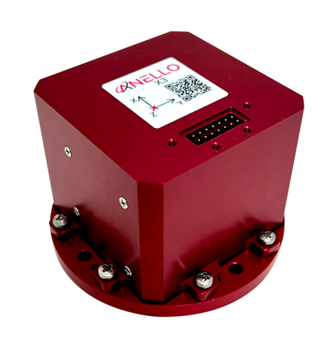
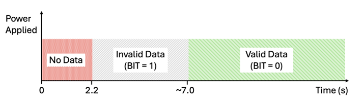

==================================
X3 Getting Started Guide
==================================

Thank you for choosing the ANELLO X3! This step-by-step guide will get you started with connection, configuration and data collection.
Please contact support@anellophotonics.com with any questions.  

1. Hardware Connections
---------------------------------
The ANELLO X3 unit is pictured below. It features a 14 pin Molex Microfit 430451427 connector.

If you received an ANELLO X3 Loaner unit, you will also receive the Accessory Kit with the items pictured below. 
For X3 purchases, the Accessory Kit is sold separately and more information is available upon request.

.. image:: media/X3_Accesory_Kit.png
   :width: 50 %
   :align: center

To use the X3 Evaluation Kit, connect the hardware as follows:

a. Connect breakout cable to X3 unit. 
b. Connect to power using the AC/DC adapter. 
c. Connect to PC, Mac, or Ubuntu computing system via RS-422 using USB 2.0 to DB9 Serial Converters. 

An SCD drawing of the X3 and a schematic of the Accessory kit breakout cable can be found in 
`Mechanicals <https://docs-a1.readthedocs.io/en/latest/mechanicals.html#anello-x3>`__.

2. Software Interfaces
---------------------------------
ANELLO provides a Python tool to connect, configure, and log data with the ANELLO X3.
Please see instructions on `ANELLO Python Tool <https://docs-a1.readthedocs.io/en/latest/python_tool.html>`__ to install and run the Python tool.
Be sure to run "git pull" regularly to make sure you are using the latest Python tool updates.

ANELLO units are also compatible with ROS using our C-based `ROS driver <https://github.com/Anello-Photonics/ANELLO_ROS_Driver>`_.

If you would like to connect to the X3 using a serial interface software such as CoolTerm, 
please ensure you use the correct baud rate **(default for the X3 is 460800), and set Data Bits = 8, Stop Bits = 1, and Parity = None.**

For a full list of software tools, please see `Software Tools <https://docs-a1.readthedocs.io/en/latest/software_tools.html>`_.

3. Configure ANELLO X3
---------------------------------
Before testing your X3, please review the `Unit Configurations <https://docs-a1.readthedocs.io/en/latest/unit_configuration.html>`_ 
and ensure they are set according to your testing needs.

The easiest way to change configurations is using the `ANELLO Python Tool <https://docs-a1.readthedocs.io/en/latest/python_tool.html#set-anello-configurations>`__.
Select *Unit Configuration* from the main menu. The default configurations will appear, and you can select *Edit* to change a configuration.

You may also send configurations manually using the `#APCFG command <https://docs-a1.readthedocs.io/en/latest/communication_messaging.html#apcfg-messages>`_ 
over the X3's configuration port using a serial interface software such as CoolTerm.

4. Data Collection
----------------------------

a. Timing
~~~~~~~~~~~~~~~~~
The timing of the startup sequence is shown below. Please allow ~7 seconds for valid data output after power is applied.

b. Log Data
~~~~~~~~~~~~~~~~~
ANELLO recommends logging data using either:
1. ANELLO `Python tool <https://docs-a1.readthedocs.io/en/latest/python_tool.html#data-collection>`__, by selecting *Log* in the main menu, OR
2. ANELLO `ROS driver <https://github.com/Anello-Photonics/ANELLO_ROS_Driver>`__

c. Monitor Data Output
~~~~~~~~~~~~~~~~~~~~~~~~~~~~~~~~~~~
The ANELLO Python Tool can be used to `monitor data <https://docs-a1.readthedocs.io/en/latest/python_tool.html#monitor-output>`__ 
from the ANELLO X3 in real-time by selecting *Monitor* in the main menu.

**Congratulations!!!**
You have completed the X3 setup! Please contact support@anellophotonics.com with any questions. 

Note: This device complies with FCC Part 15 standards. Operation is subject to the following two conditions: 
(1) This device may not cause harmful interference, and 
(2) this device must accept any interference received, including interference that may cause undesired operation.

.. [1] X3 User Manual 93001401