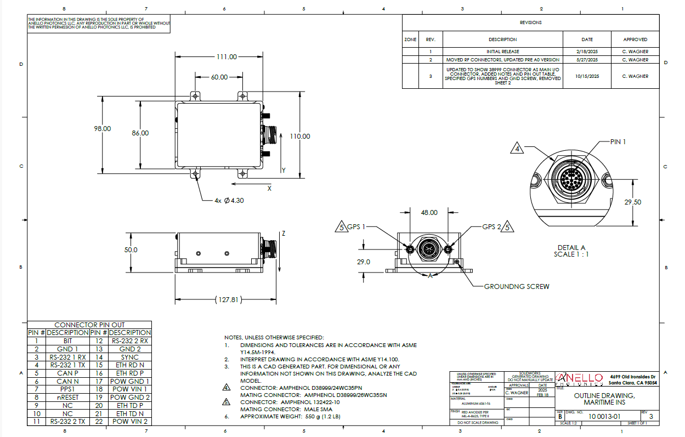

Mechanicals
==================

The ANELLO Maritime INS (P/N 10001301) features a 22 pin MIL-DTL-38999 connector. The case housing is aluminum with an anodized finish.

Maritime INS SCD Drawing: :download:`PDF <media/100013R03-Outline_DrawingMaritime_INS.pdf>`

.. note::
   If you purchased the Maritime INS Evaluation Kit, a schematic of the breakout cable can be downloaded :download:`here <media/25002301_02-25_SCD Assy Cable Maritime Breakout.pdf>` 

.. note::
   The prototype Maritime INS unit (P/N 10001302) SCD drawing can be found :download:`here <media/100013,R02-Outline_Drawing,Maritime_IMU.PDF>` and a schematic of the breakout cable can be downloaded :download:`here <media/SCD_Breakout Cable_Maritime_INS.pdf>`. The pinout for the prototype connector can also be found :download:`here <media/Plug_Socket_Face.png>`
