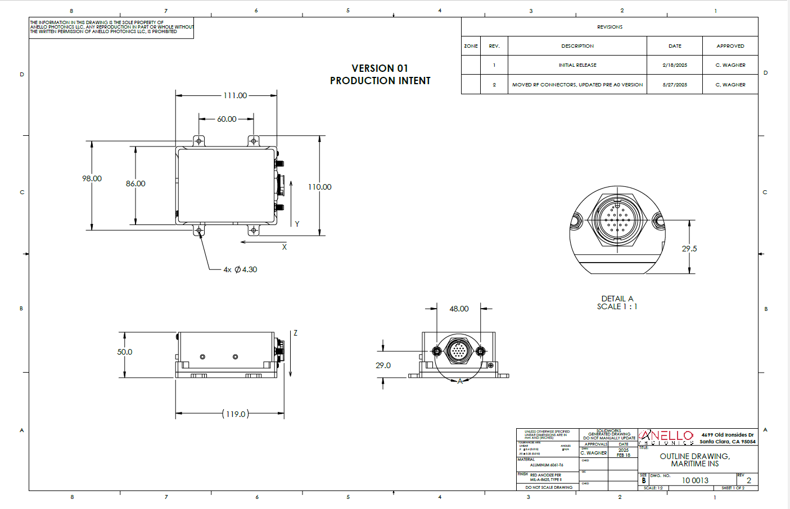

Mechanicals
==================

The ANELLO Maritime INS features a 20 pin circular connector. The case housing is aluminum with an anodized finish.

Maritime INS SCD Drawing: :download:`PDF <media/100013R03-Outline_DrawingMaritime_INS.pdf>`

Production Intent SCD Drawing:

.. note::
   If you purchased the Maritime INS Evaluation Kit, a schematic of the breakout cable can be downloaded :download:`here <media/SCD_Breakout Cable_Maritime_INS.pdf>` 

Connector Pinout:

.. image:: media/Plug_Socket_Face.png
   :width: 80%
   :align: center
