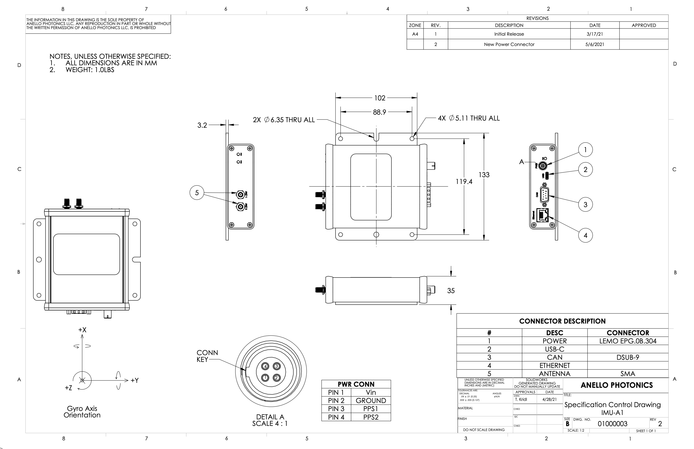

Mechanicals
==================

ANELLO EVK
---------------------------------
The ANELLO EVK features a 4-pin power connector which includes PPS input (PPS1) and output (PPS2) signals. 
It also features USB C, Ethernet, and CAN connectors, as well as two SMA RF antennae input.

EVK SCD Drawing: :download:`PDF <media/Anello_A1_MechanicalDwg_rev2.pdf>`

.. note::
   As shown in the image above, the power connector includes two additional pins: PPS Out and Sync In. The power connector included in the EVK kit includes two wires, where the black wire is PPS Out and the green wire is Sync In.
   
   Power Connector info: `<https://www.lemo.com/en/products/low-voltage-connector/b-connector>`_
   
   Mating Connector: `<https://www.lemo.com/pdf/FGG.0B.304.CLAD52.pdf>`_                                                      

ANELLO GNSS INS
---------------------------------
The ANELLO GNSS INS features a 20 pin Molex MX150 connector and two FAKRA SMB GNSS connectors. The case housing is aluminum with an anodized finish.
The ground pins (11, 12) are electrically connected to the case. There is also a case ground screw on the side of the case.

GNSS INS SCD Drawing: :download:`PDF <media/SCD_Mechanical_GNSS_INS.pdf>`

.. figure:: media/SCD_Mechanical_GNSS_INS.pdf
   :align: center

.. note::
   If you purchased the GNSS INS Evaluation Kit, a schematic of the breakout cable can be downloaded :download:`here <media/SCD_Breakout Cable_INS-GNSS.pdf>`

ANELLO IMU/IMU+
---------------------------------
The ANELLO IMU/IMU+ features an 8 pin Molex MX150 connector. The case housing is aluminum with an anodized finish.
The ground pin is electrically connected to the case. There is also a case ground screw on the side of the case.

IMU/IMU+ SCD Drawing: :download:`PDF <media/SCD_Mechanical_IMU.pdf>`

.. figure:: media/SCD_Mechanical_IMU.pdf
   :align: center

.. note::
   If you purchased the IMU/IMU+ Evaluation Kit, a schematic of the breakout cable can be downloaded :download:`here <media/SCD_Breakout Cable_IMU.pdf>`

ANELLO X3
---------------------------------
The ANELLO X3 features a 14 pin Molex Microfit 430451427 connector. Note that if your X3 serial number is below 830, 
the unit will need to be mounted on the mounting plate shipped with the unit, or similar heat sinking must be used.

X3 SCD Drawing: :download:`PDF <media/SCD_Mechanical_X3.pdf>`

.. figure:: media/SCD_Mechanical_X3.pdf
   :align: center

.. note::
   If you purchased the X3 Evaluation Kit, a schematic of the breakout cable can be downloaded :download:`here <media/SCD_Breakout Cable_X3.pdf>`

.. note::
   Please note that the X3 SCD and breakout cable drawings reflect different use cases. The X3 SCD shows the raw pinout for direct connection to the X3, while the breakout cable includes a breakout board that reassigns certain pins (e.g., replacing unused SPI lines with additional grounds) for ease of use in an evaluation setting. This results in differing pin labels, but the overall functionality remains consistent. 
