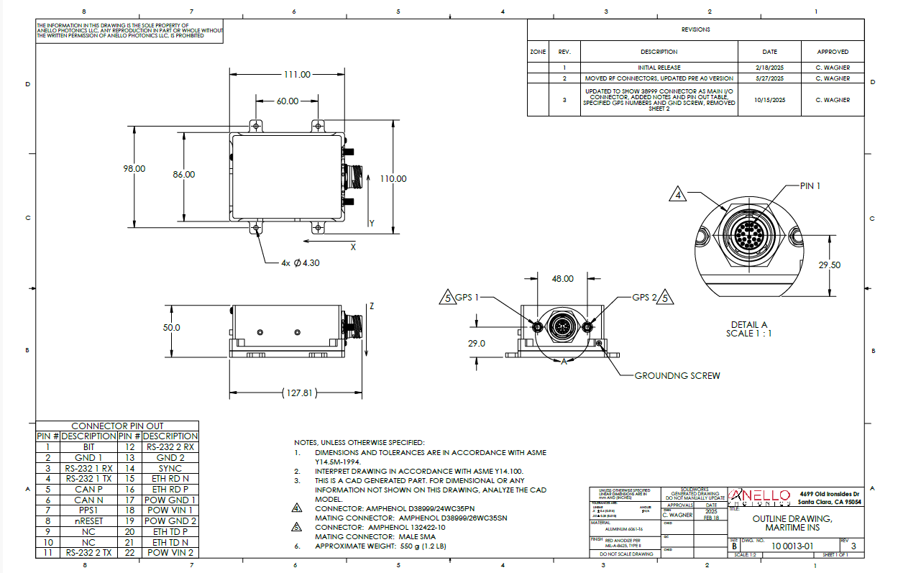

Mechanicals
==================

The ANELLO Aerial INS (P/N 10001601) features a 22 pin MIL-DTL-38999 connector. The case housing is aluminum with an anodized finish.

Aerial INS SCD Drawing: :download:`PDF <media/100013R03-Outline_DrawingMaritime_INS.pdf>`

.. note::

   If you purchased the Aerial INS Evaluation Kit, a schematic of the breakout cable can be downloaded :download:`here <media/25002231_03-25_SCD Assy Cable Maritime A0 Breakout.pdf>`.

   **Wiring Variation (Pre–February 20, 2026 Cables):**  
   Cables manufactured prior to February 20, 2026 may contain either red/black or purple/yellow CAN wiring.  
   In red/black assemblies, red corresponds to CAN_P and black to CAN_N.  
   In purple/yellow assemblies, purple corresponds to CAN_P and yellow to CAN_N.

.. note::
   Total capacitance on the RESET line (cable + input + ESD, etc.) must be ≤ 10 nF; no external reset capacitor recommended.
