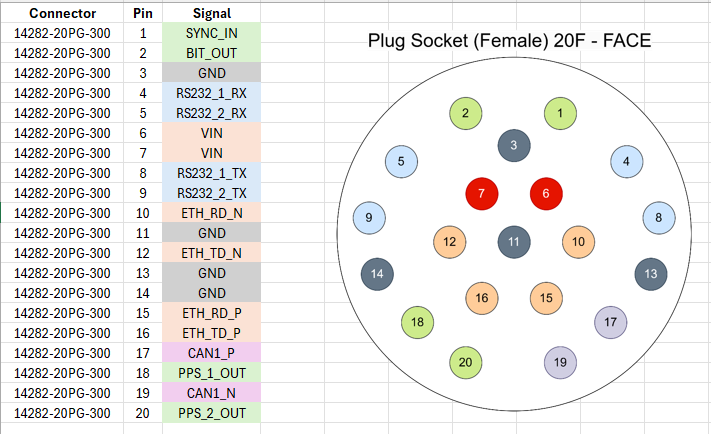

Mechanicals
==================

The ANELLO Maritime INS features a 20 pin circular connector. The case housing is aluminum with an anodized finish.

Maritime INS SCD Drawing: :download:`PDF <media/100013,R02-Outline_Drawing,Maritime_IMU.PDF>`

Pre A0 Prototype SCD Drawing:

Production Intent SCD Drawing:

.. figure:: media/SCD_Mechanical_Maritime_INS_Production_Intent.png
   :align: center

.. note::
   If you purchased the Maritime INS Evaluation Kit, a schematic of the breakout cable can be downloaded here

Connector Pinout:

