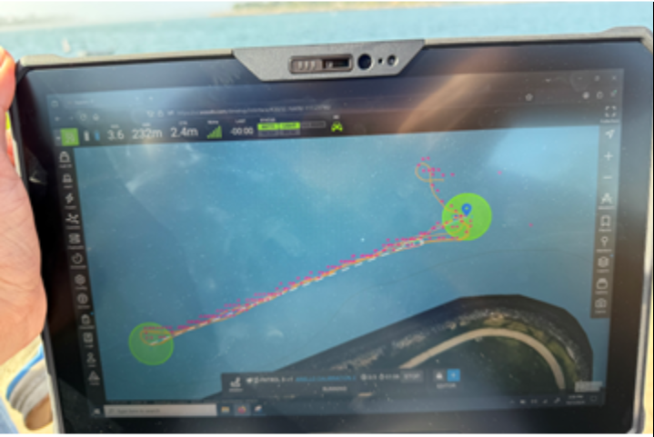

==================================
Sensor Calibrations
==================================

Paddle Wheel Calibration
---------------------------------

The ANELLO Dual Solution Maritime INS box uses paddle wheel input as a speed aiding source. From prior testing, the paddle wheels appear to have a speed-dependent scale factor which needs to be accounted for, and this can vary from boat-to-boat. 
 

Each time the ANELLO payload is installed on a new boat model, the boat’s paddle wheel needs to be calibrated relative to the boat’s motor percentage. To calibrate the paddle wheel: 

1. Launch boat into water with as little currents as possible 

2. Power on ANELLO payload while boat is stationary and allow ~30s to gain GPS 

3. Perform “out and back” mission of at least 30 second duration per leg, 2-3 times at each of the following percentages of the vehicle's max speed: 20%, 40%, 60%, 80%, 100% 

	a. If there are constant currents, performing the “out and backs” with and against the current is ideal 

	b. Ensure there are no other major sources of currents (e.g. other boats) during the “out and backs” as this will alter the calculation. If any anomalies occur (other boats, deviations from out and back route”, please jot down when it occurred so we can remove the anomaly. 

*Example "Out and Back" Mission for Paddle Wheel Calibration*

4. Once “out and backs” are complete, power off ANELLO payload 

5. After you finish other water missions, download the logs from the ANELLO box (using the instructions under Obtaining ANELLO Logs section) and send to ANELLO. 

6. ANELLO will instruct on updating the paddle wheel calibration values. 

 

**Re-calibration of the paddle wheel is necessary if any of the following conditions are met:** 

* The boat type/model is changed. 

* The location of the paddle wheel is changed. 

* The paddle wheel type/model is changed. 

* The motor type/model is changed. 

* The loaded weight of the boat is significantly changed (e.g. the weight of the boat is doubled due to a payload). 

* Otherwise, the calibration does not need to be redone for boats of the same model, with the same sensor models and similar installation positions.  

(Optional) External Magnetometer Calibration
----------------------------------------------

In the case that you will be supplying the ANELLO Dual Solution Maritime INS box with data from an external magnetometer, you may conduct an optional external magnetometer calibration procedure to improve the accuracy of the reported heading. 

 

Calibration procedures will seek to gain visibility into all potential headings and motor percentages during operation. If you will be using an electric motor, it is recommended to limit the amount of ramping of the motor during the data collection period, to minimize abrupt changes in the induced magnetic field of the motor. 

 

To calibrate the external magnetometer: 

1. Launch boat into water. 

2. Power on ANELLO payload while boat is stationary and allow ~30s to gain GPS. 

3. Perform a “figure-eight” or “flower” shaped mission at a series of increasing motor percentages, maintaining a constant motor percentage per each figure-eight or flower.  

4. Once the calibration mission is complete, power off ANELLO payload. 

5. After you finish other water missions, download the logs from the ANELLO box (using the instructions under Obtaining ANELLO Logs section) and send to ANELLO. 

6. ANELLO will instruct on updating the external magnetometer calibration values. 

 

**Re-calibration of the external magnetometer is necessary if any of the following conditions are met:** 

* The boat type/model is changed. 

* The external magnetometer type/model is changed. 

* The location of the external magnetometer is changed. 

* The motor type/model is changed. 

* The magnetic components of the boat are significantly changed. 