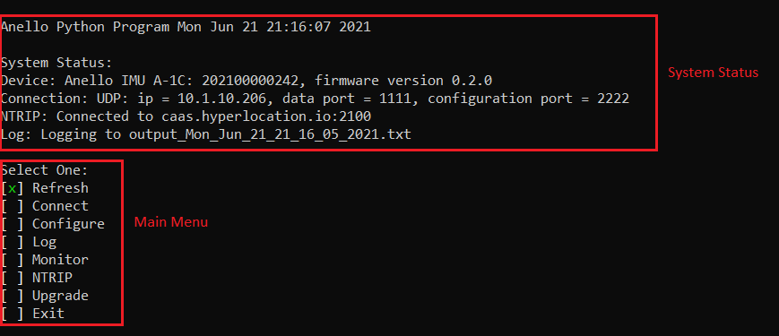

Set-Up Troubleshooting
======================

1   Install ANELLO Python Program
-----------------------------------
Confirm that Python is installed and the version is at least 3.6:

.. code-block:: python
    
    >python -V

.. note::
    If "python -V" shows version 2 despite Python 3 being installed, try "python3 -V". If that shows at Python 3.x, use "python3" instead of "python" in the following steps from command line.

In order to most easily stay up-to-date with the ANELLO Python Program, directly cloning from the 
the GitHub repository is recommended.  

.. code-block:: python

    git clone https://github.com/Anello-Photonics/user_tool.git

.. note::
    If you do not have a git client installed, you can (a) download/install a `git client  
    <https://git-scm.com/download>`_ or (b) download and unzip the source code as shown in image below.

.. figure:: media/git_download.png
   :align: center
   
   Figure 3: Zip File Direct Download (Use of *git clone* is preferred method)

Install dependencies using pip:

If this is your first time to run user_program.py, you may need to install dependencies with PIP.
PIP is Python's package manager, and it is usually installed by default in Python installations.  If you are unfamiliar
with PIP a quick start guide is found `here <https://pip.pypa.io/en/stable/quickstart/>`_

.. code-block:: python

    cd user_tools
    pip install -r requirements.txt

If this fails, you may need to replace "pip" with "pip3", "python -m pip" or "python3 -m pip"

On some Linux systems, matplotlib and numpy dependencies must be installed with apt instead of pip.
Instead of using requirements.txt, do:

.. code-block:: python

    pip install cutie
    pip install pyserial
    pip install PySimpleGUI
    sudo apt install matplotlib
    sudo apt install numpy

Or if you already installed requirements.txt and ran the program, but had a matplotlib or numpy error:

.. code-block:: python

    pip uninstall matplotlib
    pip uninstall numpy
    sudo apt install matplotlib
    sudo apt install numpy

2   Run Python Program
---------------------------
Ensure the power cable is connected and the green power light is illuminated. To 
perform initial unit configuration, use the USB-C interface. Connect the USB-C cable between your computer 
and the EVK. From the board_tools directory, run user_program.py. 

.. code-block:: python

    cd board_tools
    python user_program.py

You should now see the System Status and Main Menu, as shown below.
This program uses a keyboard interface. Move the cursor up and down with arrow keys and select with enter key. For some settings you will enter text.

.. note::
    On some Windows computers, the arrow keys did not move the cursor.
    This appears to be an issue with the readchar dependency, version 3.0.5 on Windows.
    It can be fixed with this command in terminal:

    pip install readchar==3.0.4

The ANELLO Python Program is divided into two subsections as shown in the image below. The System Status 
and a Main Menu. The EVK will shows as **not connected**, until the EVK is explicitly connected via the
Connection option. 

   Figure 4: ANELLO Python Program Home Screen

The main menu actions are:

-   Refresh:               Refresh the display to see new system status
-   Connect:               Connect to the EVK over COM or UDP
-   Restart Unit:          Restart the EVK
-   Unit Configuration:    Edit EVK configurations such as output data rate
-   Vehicle Configuration: Set lever arms such as to antennae and vehicle center
-   Log:                   Collect EVK GPS, IMU, and INS data and convert to CSV
-   Monitor:               Opens a display showing the real-time INS message contents
-   NTRIP:                 Connect to a server for GNSS corrections
-   Upgrade:               Change the EVK firmware version
-   Exit:                  Exit the python program

3   Connect to EVK
----------------------
Select *Connect* form the main menu and press enter. Select *COM* then *Auto*. The unit will
be auto-detected over USB-C.  

The ANELLO EVK uses two logical ports: 

    +-------------------------+-----------------------------------+
    | **Logical Port**        |  **Physical Port** (Serial/USB-C) |
    +-------------------------+-----------------------------------+
    |  Data Port              | lowest port number e.g., COM7     |
    +-------------------------+-----------------------------------+
    |  Configuration  Port    | highest port number e.g., COM10   |
    +-------------------------+-----------------------------------+
     

Once connected, the System status will be updated with the mapping of the logical ports to the virtual COM 
ports. When using UDP, the user has the flexibility to assign the data port and user
messaging port through the Anello Python Program.

If the auto detection fails, you can try manual connection. First check that there are four virtual COM ports. 
On Windows, use the device manager to find the COM ports. On Mac and Ubuntu, use the terminal and change directory to */dev*, 
and check for four consecutive ports, typically named something like *tty.usbserial-xxx* on MAC/Ubuntu.

.. note::
    The EVK generates four virtual COM ports on the host; however only two are used. The numerically 
    highest port is the configuration port.  The numerically lowest port is the data port. 
    Communication occurs at a fixed baudrate of 921600 bits per second.

.. note::
    If the four COM ports do not show in the manual connection mode or Windows device manager, you may need to install the `FTDI drivers <https://ftdichip.com/drivers/d2xx-drivers/>`_

On Ubuntu or other operating systems, the program may not have permission to access serial ports causing the connect step to fail.
This can be fixed by increasing user permissions or running as root.

1. Increasing user permissions:
The user may need to be added to groups "tty" or "dialout" to access the serial port.

.. code-block:: python

    sudo usermod -a -G tty <your user name>
    sudo usermod -a -G dialout <your user name>

Then log out and back in for the permissions to apply.

2. Running as root:
Root may have a different default python, so check your python location with :

.. code-block:: python

    which python

then run as root using that path to python:

.. code-block:: python

    sudo <path to python> user_program.py

On Windows, the firewall can block communication on UDP ports.
When this issue happens, you can connect by UDP in user_program.py and read/write configurations, but the logs and monitor are empty.

To fix:

- in Windows start menu, search "firewall", then click "Firewall & network protection"
- click "Allow an app through firewall"
- In the popup: click "change settings"
- Scroll down to see if "Python" is in the list.
- if not: click "allow another app" -> "Browse" and select your python.exe
- Check the "public" and "private" boxes for Python, then click "ok".

If you have multiple Python versions installed, ensure firewall lists the version you use to run user_program.

- in cmd: check the Python location and version with:

.. code-block:: python

    where python

and

.. code-block:: python

    python --version

- use that path while adding Python in the firewall settings.
- Or select Python in the firewall list, click "details" and verify the path matches.
