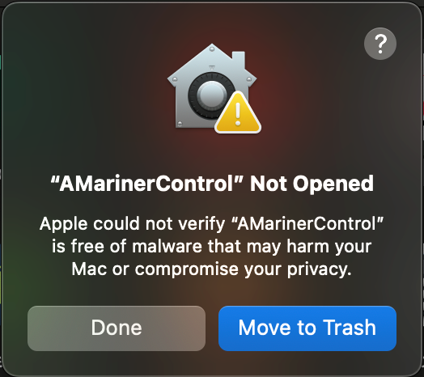
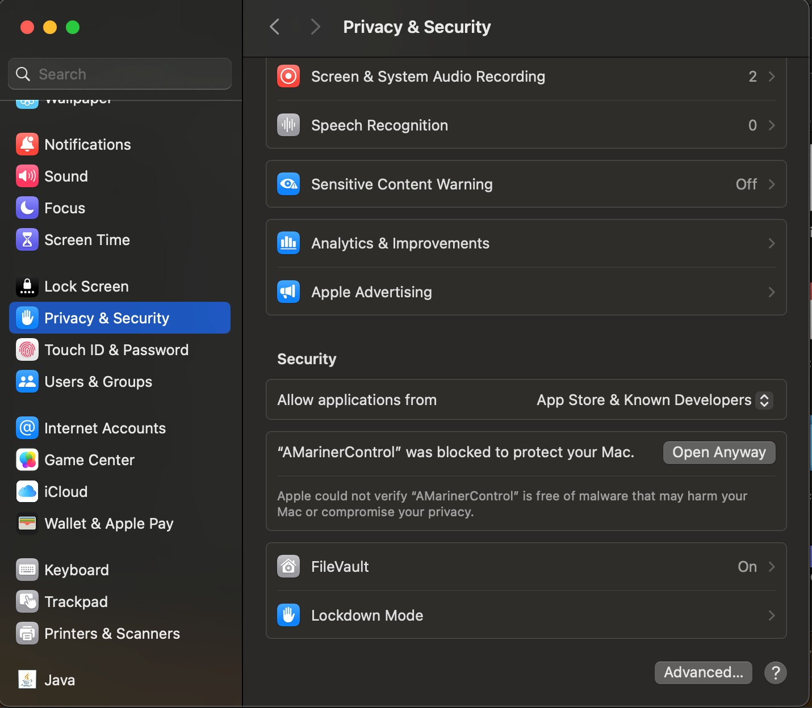
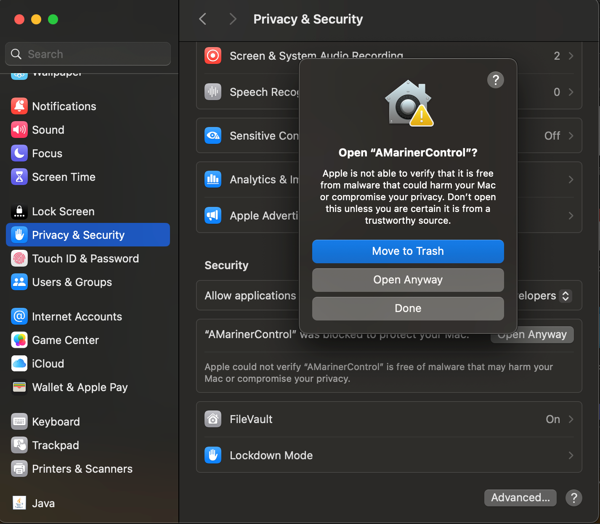
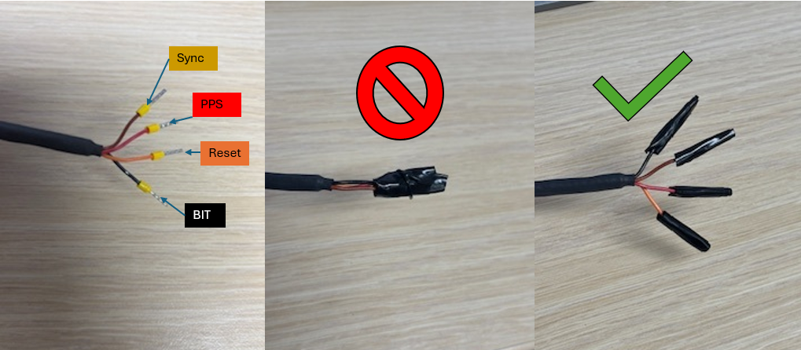

=========================
Troubleshooting
=========================

Software Tools
----------------------------

AMarinerControl
~~~~~~~~~~~~~~~~~~~~~~~~~~~

Linux
^^^^^^^^^^^^^^^^^^^^^^^^^^^
On Ubuntu/Debian, the AMarinerControl.AppImage may require the following libraries:

.. code-block:: bash
    :caption: Terminal

	sudo apt update
	sudo apt install libpulse0 libxcb-cursor0 libxcb-shape0

MacOS
^^^^^^^^^^^^^^^^^^^^^^^^^^^

AMarinerControl for MacOS is unsigned the following error message may appear when installing for the first time.

To open the app, go to System Settings > Privacy and Security, scroll to the bottom of the page and select "Open Anyway" to the dialogue "'AMarinerControl' was blocked to protect your Mac"

Select "Open Anyway" again

When prompted, enter your MacOS password and proceed with opening the app.

ANELLO INS Scripts
~~~~~~~~~~~~~~~~~~~~~~~~~~~~~

anello_fw_uploader.py
^^^^^^^^^^^^^^^^^^^^^^^^^^^^

Firmware updates requires the installation of the python libraries pyserial and pymavlink

.. code-block:: bash
    :caption: Terminal

    	pip3 install pyserial pymavlink

Hardware
------------------

Reset Wire
~~~~~~~~~~~~~~~~~~

The 4-wire bundle included with the ANELLO Maritime INS development kit breakout harness provides Reset, PPS, Sync, and BIT signals. Under normal operating conditions, the Reset line is held high at 3.3V. Driving this line low will force the device into a reset state.

To ensure proper operation, do not tape or heat-shrink the Reset wire together with other wires, and avoid inadvertently grounding it. If the Reset line is held low, the device will remain in a reset (powered-off) state and will appear unresponsive.

