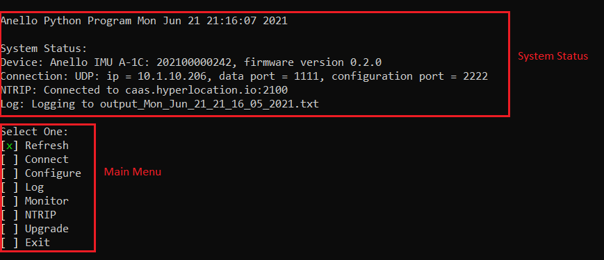
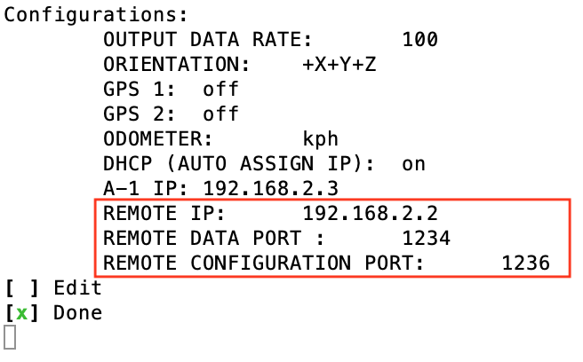
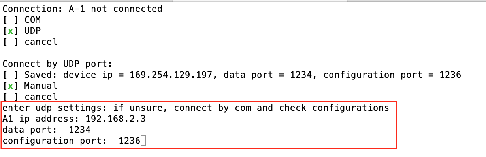
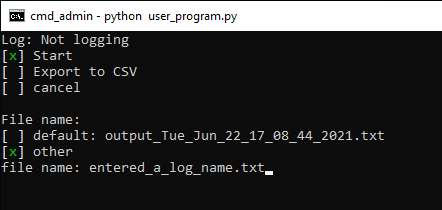
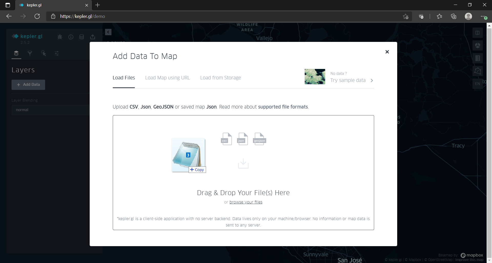
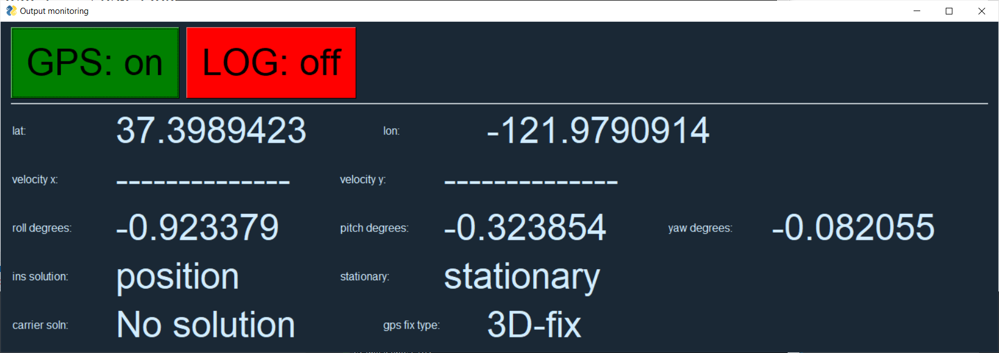
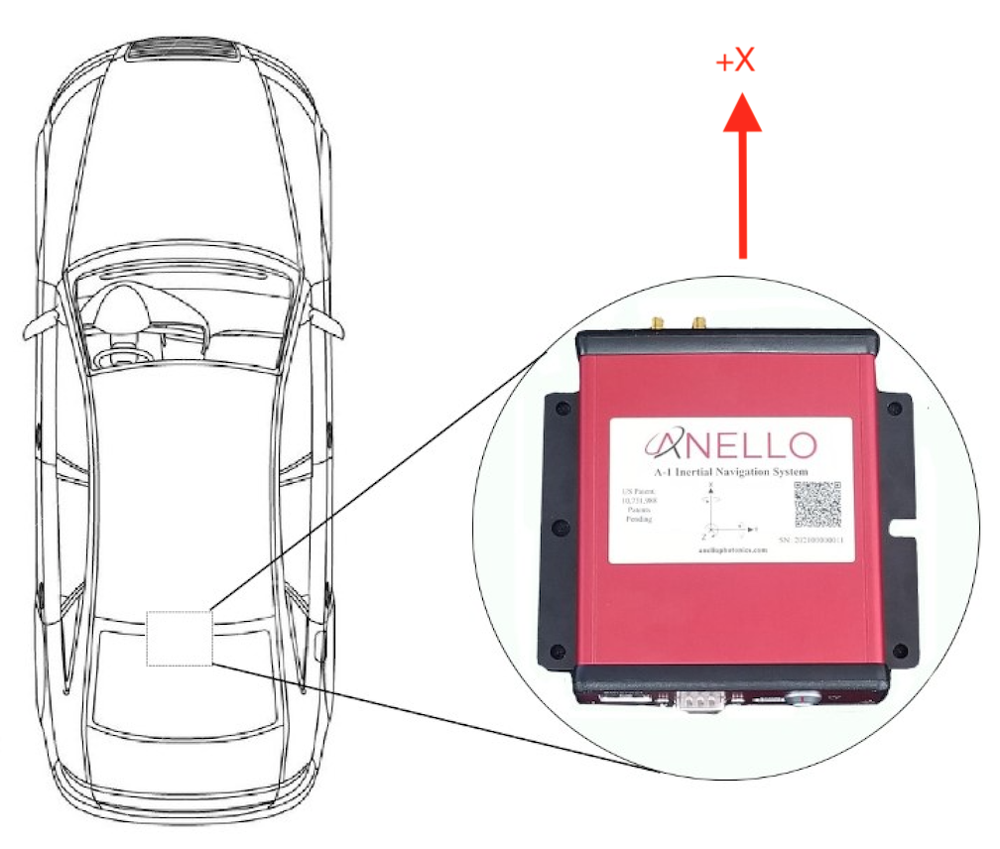

Getting Started Guide
=======================

1. EVK Contents
------------------------

The Anello A-1 EVK includes the eight items highlighted below:

.. figure:: media/evk_contents.png
   :align: center

   Figure 1: Anello A-1 EVK Contents

 
    +---+------------------------------------------------+
    | 1 | A-1 Inertial Navigation System                 +
    +---+------------------------------------------------+
    | 2 | Two Dual-Band Multi-Constellation GNSS Antennae|
    +---+------------------------------------------------+
    | 3 | A-1 System Power Cable                         |
    +---+------------------------------------------------+
    | 4 | 110-240VAC Wall-Power Adaptor Plug             |
    +---+------------------------------------------------+
    | 5 | International Wall Power Plug Inserts          |
    +---+------------------------------------------------+
    | 6 | In-Vehicle Power Adaptor                       |
    +---+------------------------------------------------+
    | 7 | USB-C Cable                                    |
    +---+------------------------------------------------+
    | 8 | Ethernet Cable                                 |
    +---+------------------------------------------------+

A diagram of the standard system connection is shown below.  The power connection is made with the A-1 
System Power Cable.  The A-1 System Power Cable can be connected to the Wall-Power Adaptor or the 
In-Vehicle Power Adaptor.  This is shown in the diagram below by the Green and Yellow connections.

.. figure:: media/evk_wiring.png
   :scale: 50 %
   :align: center

   Figure 2: Anello A-1 Connection Diagram

The USB-C connects to a PC, MAC, or Ubuntu system in order to configure the unit with the Anello Python Program. This is shown by the red connection.
The USB interface generates four virtual com ports on the host system of which two are active (highest and 
lowest).  The USB interface is the recommended interface for initial system checkout and configuration.

The Ethernet interface and cable is recommended for primary data collection and communication interface.  
Ethernet is robust, stable, and fast by comparison to virtual com ports.  Typical Ethernet connections to a mobile router 
are shown by the black connections.

The GNSS antennae is shown in the blue connection, and the Primary Antennae is marked as ANT1.  Connection of GPS2/ANT2 is optional.

    +------+------+------+
    | GPS1 | ANT1 | PPS1 |
    +------+------+------+
    | GPS2 | ANT2 | PPS2 |
    +------+------+------+
    
.. note::
    The unit should **NOT** be directly powered by USB-C.  Due to the unpredictable sleep mode and other 
    current sourcing limitations on some computer systems, the use of USB-C for powering the A-1 may 
    lead to intermittent behavior.

2. Install Anello Python Program 
---------------------------------

The Anello Python Program runs on modern PC, MAC, and Ubuntu based computing systems.  A full introduction
to the Anello Python Program is provided in other sections of this Manual.  The Anello Python Program is 
open-source licensed (BSD license) and directly downloaded from Anello’s public GitHub repository.

Before getting started, first ensure that your computing platform has Python installed.  Python version 3 
is required, and Anello does not provide support for Python 2 installations.  If your computer does not 
have Python installed, please see the following link to download and install Python:
`<https://www.python.org/downloads/>`_

2.1 Confirm Python Installation
~~~~~~~~~~~~~~~~~~~~~~~~~~~~~~~~~~~

Open a command or terminal window and type.  

.. code-block:: python
    :emphasize-lines: 3

    python -v
    ...
    Python 3.7.0 (default, Jul 23 2018, 20:24:19)
    ...
    exit()

Confirm that Python is installed and the version is at least 3.6

If "python -v" shows version 2 despite Python 3 being installed, try "python3 -v" instead.
If that shows Python 3.x, use "python3" instead of "python" in the following steps from command line.

2.2 Install the Software
~~~~~~~~~~~~~~~~~~~~~~~~~~~

In order to most easily upgrade the Anello Python Program, directly cloning from the 
the GitHub repository is recommended.  

.. code-block:: python

    git clone https://github.com/Anello-Photonics/user_tool.git

.. note::
    If you do not have a git client installed, you can (a) download/install a git client  from 
    `<https://git-scm.com/download>`_ or (b) download and unzip the source code as shown in image below.

.. figure:: media/git_download.png
   :align: center
   
   Figure 3: Zip File Direct Download (Use of *git clone* is preferred method)

Install dependencies using pip:

If this is your first time to run user_program.py, you may need to install dependencies with PIP.
PIP is Python's package manager, and it is usually installed by default in Python installations.  If you are unfamiliar
with PIP a quick start guide is found here `<https://pip.pypa.io/en/stable/quickstart/>`_

.. code-block:: python

    cd user_tools
    pip install -r requirements.txt

If this fails, you may need to replace "pip" with "pip3", "python -m pip" or "python3 -m pip"

On some Linux systems, matplotlib and numpy dependencies must be installed with apt instead of pip.
Instead of using requirements.txt, do:

.. code-block:: python

    pip install cutie
    pip install pyserial
    pip install PySimpleGUI
    sudo apt install matplotlib
    sudo apt install numpy

or if you already installed requirements.txt, and ran the program, but had a matplotlib or numpy error, do:

.. code-block:: python

    pip uninstall matplotlib
    pip uninstall numpy
    sudo apt install matplotlib
    sudo apt install numpy

2.3 Run the Tool 
~~~~~~~~~~~~~~~~~~~~~~~~~~~~~~~~~~~
Ensure the Power Cable is connected and the Green power light is illuminated.  To get started and 
perform initial unit configuration, use the USB-C interface.  Connect the USB-C cable between your computer 
and the Anello A-1.  From the board_tools directory, run user_program.py. 

.. code-block:: python

    cd board_tools
    python user_program.py

The Anello Python Program is divided into two subsections as shown in the image below.  The System Status 
and a Main Menu.   The A-1 unit will shows as **not connected**, until the A-1 is explicitly connected via the
Connection option.      

   Figure 4: Anello Python Program Home Screen

The main menu actions are:

-   Refresh:    Refresh the display to see new system status.
-   Connect:    Connect the app to the A-1 over com or udp to configure and log
-   Configure:  edit A-1 device configurations such as udp connection settings, output data rate
-   Log:        collect the A-1 raw message output into a file. Can convert to CSV.
-   Monitor:    opens a display showing the latest INS message contents.
-   Ntrip:      connect to a server for navigation corrections.
-   Upgrade:    upgrade the A-1 with a newer firmware version
-   Exit:       exit the program

these are explained in the following sections.

2.4 Connect to the A-1
~~~~~~~~~~~~~~~~~~~~~~~~~~~~~~~~~~~
Select the Connect option form the selection menu and press return. Select COM and then Auto. The unit will
be auto detected via Serial over USB-C.  

The Anello A-1 uses two logical ports: 

    +-------------------------+-----------------------------------+
    | **Logical Port**        |  **Physical Port** (Serial/USB-C) |
    +-------------------------+-----------------------------------+
    |  Data Port              | lowest port number e.g., COM7     |
    +-------------------------+-----------------------------------+
    |  Configuration  Port    | highest port number e.g., COM10   |
    +-------------------------+-----------------------------------+
     

Once connected the System status should be updated and the mapping of the logical ports to the virtual com 
ports shows in the System Status. When using UDP, the user has the flexibility to assign the data port and user
messaging port through the Anello Python Program.

If the auto detection fails, you can try manual connection.  First check that there are four virtual com ports. 
On Windows, use the device manager to find the COM ports.  On MAC and Ubuntu, use the terminal and change directory to */dev*, 
and check for four consecutive ports, typically named something like *tty.usbserial-xxx* on MAC/Ubuntu.

.. note::
    Anello A-1 generates four virtual com ports on the host; however only two are used. The numerically 
    highest port is the configuration/control port.  The numerically lowest port is the data port. 
    Communication occurs at a fixed baudrate of 921600 bits per second.

.. note::
    If the four COM ports do not show in the manual connection mode or Windows device manager, you may need to install the FTDI drivers from https://ftdichip.com/drivers/d2xx-drivers/

2.5 Adjust unit configuration
~~~~~~~~~~~~~~~~~~~~~~~~~~~~~~~~~~~
The A-1 can be configured to allow connection over ethernet(UDP), and to adjust other device settings.
To adjust configuration, select *Configure* from the main menu while connected. The current configurations will display.
To change a configuration, select *Edit* and then the configuration to change. Select or type in the new value.

General configurations:

-   Output Data Rate    (20/50/100/200) - rate of INS and IMU message outputs in Hz.
-   Orientation         (+X+Y+Z or other right handed frames) - coordinate system for A-1.
-   Enable GPS          (on/off) - let the A-1 use the GPS antenna
-   Odometer Unit       (mps/mph/kph/fps) - speed unit for odometer input
-   Enable FOG          (on/off) - let the A-1 use the Fiber Optic Gyro for angular rate z.

UDP connection configurations:

-   DHCP (on/off)               if on, the A-1 ip is assigned by router. If off, pick the ip yourself.
-   UDP  A-1 ip                       ip address for the A-1. Can only set this when DHCP off
-   UDP computer ip                   ip address of your computer, which A-1 will connect to.
-   UDP computer data port            remote device's port for data channel. This works like the data and config com ports.
-   UDP computer configuration port   remote devices port for config channel

.. note::
    The above UDP ports are the numbers on the connected computer only. The A-1 uses UDP ports 1 for data and 2 for configuration.
    If sending odometer speeds by UDP from another program, send to UDP port 2 on the A-1, from the computer UDP config port matching the configurations.

See the Unit Configurations page for more details.

2.5.1 Connecting by UDP
~~~~~~~~~~~~~~~~~~~~~~~~~~~~~~~~~~~
The A-1 Ethernet interface is recommended for in Vehicle collection and testing. To connect by UDP over ethernet, the A-1 must first be configured over com.

In this step, the A-1 configuration is adjusted.  Configuring the Ethernet interface consists
of four steps.

1. Set the A-1 IP address Statically or automatically using DHCP (default)
2. Set the IP address of where you want the A-1 to send data i.e., the Receiving Computer's IP
3. Set the Data Port and User Messaging Port numbers
4. Connect to the A-1 via UDP instead of USB. Use the same A-1 ip, configuration port and data port as in 2-3.

.. figure:: media/conf_no_ipassignment.png
   :scale: 50 %
   :align: center

   Anello Configuration with no A-1 IP Assignments

.. figure:: media/conf_dhcp_complete.png
   :scale: 50 %
   :align: center

   Step 1: Configure A-1 IP (DHCP or Static Assignement)

   Step 2 and 3: Set Remote IP and Ports

   Step 4: Connect with UDP

** Congratulations!!! **
You have completed the initial setup and verification of the Anello A-1.  Prior to
installing the A-1 to the vehicle, you may want to confirm additional set up items such as
Mounting/Orientation, NTRIP, etc.

.. note::
    You may need to adjust firewall settings on your computer to ensure that the UDP ports you have selected are open
    for traffic.  Windows will automatically prompt a warning as shown in image below.

   Windows PC Warning for UDP

2.6 Set Vehicle Configurations
~~~~~~~~~~~~~~~~~~~~~~~~~~~~~~~~~~~
Vehicle configurations describe the setup of the A1 and other devices in your vehicle and help the navigation algorithm. If you're setting up the A1 now, this can wait until you install it in the vehicle.
From the main menu, select "VEHICLE CONFIGURATIONS" to set the following:

- Position of both GPS antennas
- Center of rear wheels, for odometer
- Origin for navigation output

See the Vehicle Configurations page for more details.

2.7 Log a data file
~~~~~~~~~~~~~~~~~~~~~~~~~~~~~~~~~~~
The log function collects the A-1 output messages of all types into a single text file. The log can be parsed into separate
CSV files for each message type, which can be used to

While connected by COM or UDP, select *Log* in the main menu, then *Start*. You can use the default name based on the time, or enter a name.
The current log file is show in system status. To end the log, select *Log* and then *Stop*.

   Starting a log.

The log files are under the logs directory, grouped in directories by month and then day.

The comma separated variable (CSV) format is useful for importing to other tools.
To export a log file to CSV, Select *Log*, then *Export*. Then select the log file to convert in the file picker.

A single log file containing a mix of message types is converted into separate CSV files for each message type.
These are saved in the exports directory under the name of the original log file.
For example, exporting log1.txt will create these files under under the exports/log1 directory:

-   imu.csv : raw IMU data such as acceleration and angular rates (APIMU messages)
-   gps.csv : GNSS data (APGPS messages)
-   ins.csv : primary inertial navigation solution data (APINS messages)

The first row of the file lists the message fields. Each other row is one message split into fields, in that same order.
The gps and ins files also have the final column "position_geojson": a formatted point to display in Kepler.gl, not part of the original message.

The exported CSVs can be visualized at `Kepler <https://kepler.gl/demo>`_ which is an online tool
for geo-spatial data analysis. If the A-1 GNSS antenna is indoors or not connected, the resulting file may
not render in Kepler.gl tool, but this step demonstrates the process regardless. If the csv files fail to upload, check if they are empty and only upload the non-empty ones.

.. note::
    Kepler.GL does NOT store any data in the cloud.  It is purely client side browser app.

To use kepler.gl, drag and drop the exported csv files:

The APINS and APGPS messages will both be shown as layers. You can toggle the visibility of each layer by clicking the eye icon.

Or click the dual map view button (upper left) to view the layers in a split screen. Check or uncheck the desired layers on each side.

2.8 Monitor Output
~~~~~~~~~~~~~~~~~~~~~~~~~~~~~~~~~~~
Monitoring mode opens a display to watch the data of the INS solution in real-time.
It also allows toggling the logging and gps connection with the LOG and GPS buttons

To start monitoring, select *Monitor* in the main menu. This will launch a separate window. Close it to return to the main menu.

   Output Monitoring

Some message fields may not appear until the A-1 is turned on for enough time, with GNSS antennas connected.

2.9 Connect to NTRIP Caster
~~~~~~~~~~~~~~~~~~~~~~~~~~~~~~~~~~~
Connecting to an NTRIP caster will improve the accuracy of GNSS positioning.
NTRIP requires connecting over UDP in firmware versions before 0.4.3, after which it can be used over UDP or serial.

From the main menu, select *NTRIP* and then *Start*. Then enter the NTRIP caster details as prompted

-   caster: url or ip address
-   port: usually 2101
-   mountpoint
-   username
-   password
-   send GGA (yes/no) - whether the caster requires a GGA message for the device position.

The system status will show the NTRIP connection status. The details of the last used caster are saved.

2.10 Firmware Upgrade
~~~~~~~~~~~~~~~~~~~~~~~~~~~~~~~~~~~
To upgrade to a newer firmware version: Connection over COM, select *UPGRADE* from the main menu, then select *yes*. Then follow the instructions on the screen
The upgrade currently requires the windows executable included in the user_tools repo, HtxAurixBootLoader.exe.
The A-1 output will halt until the upgrade is complete. After upgrading, the new firmware version number should show in system status.

3. Vehicle Installation
------------------------

The A-1 is easy to install on a land vehicle.  The mounting location of the A-1 is flexible and can be configured for various 
installation positions and orientations.  For getting starting quickly and minimizing the configuration steps, 
the recommendation is to mount the unit nearer the vehicle’s rear axle and along the vehicle 
centerline with the X-Axis facing forward along the direction of travel.  This mounting location will ensure 
good results with minimal configuration.

   Default A-1 Installation Location

If the unit is oriented differently, then the orientation (“orn”) setting must be configured using the Anello 
Python Program.

See Advanced configuration and Anello Python Program detailed descriptions.

The GNSS antennae should be placed on the roof of the vehicle. The primary GNSS antenna is labelled GPS1 on 
the back of the A-1.  GPS1 must be connected for proper system operation.  GPS2 is optional. 

If the primary antennae is placed directly above the IMU, this results in the simplest lever-arm configuration. 
**Avoid** placing the antennae on significantly curved surfaces as 
this will reduce the available sky view of the Antennae.  **Do not place the antennae inside the vehicle or 
underneath other things (especially metal) as this will significantly reduce the GNSS signal quality.**

The antennae provided in the Anello EVK magnetically mounts to the vehicle roof.  Alternative GNSS antennae can be 
used, so long as they support *BOTH GPS L1 and L2C bands as well as the equivalent signals on the 
Glonass, Galileo, and Beidou constellations*.  Contact Anello if there are questions about using an alternate 
GNSS antennae.  

Finally, the EVK ships with an in-vehicle power adaptor.  If the in-vehicle power adaptor is used, please ensure the plug is 
securely and fully inserted.   Alternatively, cut-off in-vehicle power adaptor and connect the red and black power lines 
to a stable source of power in the range of 8 to 30 VDC.

Once the Anello A-1 is properly installed in the vehicle, you are ready to collect data.  Unlike other 
systems, the Anello A-1 does not require an extensive driving calibration prior to usage.  However, the 
system does require exceeding 2m/s velocity to enter full INS mode, and the performance will generally improve after 
the first 5 minutes of driving.

.. note::

    Use of a single band (L1 only) GNSS antennae will result in a significant reduction of accuracy and 
    likely prevent RTK from working at all. Please ensure the antennae has at least dual-band support.

    A known limitation of the initial A-1 unit is that it is intended for wheeled land vehicles.  Contact 
    Anello about availability and support for other vehicle types such as aircraft/drones, marine vehicles, 
    and tracked land vehicles

    The initial release supports logging data from both GNSS antennas, but does not include GNSS static heading 
    initialization.

