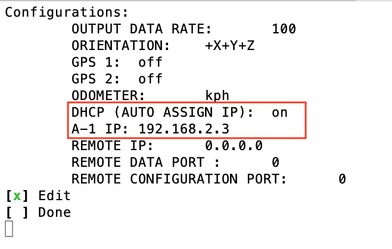

Getting Started Guide
=======================

1. EVK Contents
------------------------

The Anello A-1 EVK includes the eight items highlighted below:

.. figure:: media/evk_contents.png
   :align: center

   Figure 1: Anello A-1 EVK Contents

 
    +---+------------------------------------------------+
    | 1 | A-1 Inertial Navigation System                 +
    +---+------------------------------------------------+
    | 2 | Two Dual-Band Multi-Constellation GNSS Antennae|
    +---+------------------------------------------------+
    | 3 | A-1 System Power Cable                         |
    +---+------------------------------------------------+
    | 4 | 110-240VAC Wall-Power Adaptor Plug             |
    +---+------------------------------------------------+
    | 5 | International Wall Power Plug Inserts          |
    +---+------------------------------------------------+
    | 6 | In-Vehicle Power Adaptor                       |
    +---+------------------------------------------------+
    | 7 | USB-C Cable                                    |
    +---+------------------------------------------------+
    | 8 | Ethernet Cable                                 |
    +---+------------------------------------------------+

A diagram of the standard system connection is shown below.  The power connection is made with the A-1 
System Power Cable.  The A-1 System Power Cable can be connected to the Wall-Power Adaptor or the 
In-Vehicle Power Adaptor.  This is shown in the diagram below by the Green and Yellow connections.

.. figure:: media/evk_wiring.png
   :scale: 50 %
   :align: center

   Figure 2: Anello A-1 Connection Diagram

The USB-C connects to a PC, MAC, or Ubuntu system in order to configure the unit with the Anello Python Program. This is shown by the red connection.
The USB interface generates four virtual com ports on the host system of which two are active (highest and 
lowest).  The USB interface is the recommended interface for initial system checkout and configuration.

The Ethernet interface and cable is recommended for primary data collection and communication interface.  
Ethernet is robust, stable, and fast by comparison to virtual com ports.  Typical Ethernet connections to a mobile router 
are shown by the black connections.

The GNSS antennae is shown in the blue connection, and the Primary Antennae is marked as ANT1.  Connection of GPS2/ANT2 is optional.

    +------+------+------+
    | GPS1 | ANT1 | PPS1 |
    +------+------+------+
    | GPS2 | ANT2 | PPS2 |
    +------+------+------+
    
.. note::
    The unit should **NOT** be directly powered by USB-C.  Due to the unpredictable sleep mode and other 
    current sourcing limitations on some computer systems, the use of USB-C for powering the A-1 may 
    lead to intermittent behavior.

2. Install Anello Python Program 
---------------------------------

The Anello Python Program runs on modern PC, MAC, and Ubuntu based computing systems.  A full introduction
to the Anello Python Program is provided in other sections of this Manual.  The Anello Python Program is 
open-source licensed (BSD license) and directly downloaded from Anello’s public GitHub repository.

Before getting started, first ensure that your computing platform has Python installed.  Python version 3 
is required, and Anello does not provide support for Python 2 installations.  If your computer does not 
have Python installed, please see the following link to download and install Python:
`<https://www.python.org/downloads/>`_

2.1 Confirm Python Installation
~~~~~~~~~~~~~~~~~~~~~~~~~~~~~~~~~~~

Open a command or terminal window and type.  

.. code-block:: python
    :emphasize-lines: 3

    python -v
    ...
    Python 3.7.0 (default, Jul 23 2018, 20:24:19)
    ...
    exit()

Confirm that Python is installed and the version is at least 3.x 

2.2 Install the Software
~~~~~~~~~~~~~~~~~~~~~~~~~~~

In order to most easily upgrade the Anello Python Program, directly cloning from the 
the GitHub repository is recommended.  

.. code-block:: python

    git clone https://github.com/Anello-Photonics/user_tool.git

.. note::
    If you do not have a git client installed, you can (a) download/install a git client  from 
    `<https://git-scm.com/download>`_ or (b) download and unzip the source code as shown in image below.

.. figure:: media/git_download.png
   :align: center
   
   Figure 3: Zip File Direct Download (Use of *git clone* is preferred method)

2.3 Run the Tool 
~~~~~~~~~~~~~~~~~~~~~~~~~~~~~~~~~~~
Ensure the Power Cable is connected and the Green power light is illuminated.  To get started and 
perform initial unit configuration, use the USB-C interface.  Connect the USB-C cable between your computer 
and the Anello A-1.  From the board_tools directory, run user_program.py

.. code-block:: python

    cd board_tools
    python user_program.py

The Anello Python Program is divided into two subsections as shown in the image below.  The System Status 
and a Main Menu.   The A-1 unit will shows as **not connected**, until the A-1 is explicitly connected via the
Connection option.      

 

   Figure 4: Anello Python Program Home Screen

2.4 Connect to the A-1
~~~~~~~~~~~~~~~~~~~~~~~~~~~~~~~~~~~
Select the Connect option form the selection menu and press return. Select COM and then Auto. The unit will
be auto detected via Serial over USB-C.  

The Anello A-1 uses two logical ports: 

    +-------------------------+-----------------------------------+
    | **Logical Port**        |  **Physical Port** (Serial/USB-C) |
    +-------------------------+-----------------------------------+
    |  Data Port              | lowest port number e.g., COM7     |
    +-------------------------+-----------------------------------+
    |  Configuration  Port    | highest port number e.g., COM10   |
    +-------------------------+-----------------------------------+
     

Once connected the System status should be updated and the mapping of the logical ports to the virtual com 
ports shows in the System Status. When using UDP, the user has the flexiblity to assign the data port and user
messaging port thru the Anello Python Program.

If the auto detection fails, you can try manual connection.  First check that there are four virtual com ports. 
On Windows, use the device manager to find the COM ports.  On MAC and Ubuntu, use the terminal and change directory to */dev*, 
and check for four consecutive ports, typically named something like *tty.usbserial-xxx* on MAC/Ubuntu.

.. note::
    Anello A-1 generates four virtual com ports on the host; however only two are used. The numerically 
    highest port is the configuration/control port.  The numerically lowest port is the data port. 
    Communication occurs at a fixed baudrate of 921600 bits per second.

2.5 Log a data file
~~~~~~~~~~~~~~~~~~~~~~~~~~~~~~~~~~~
In this step, a short data file is captured. The results are displayed in `Kepler <https://kepler.gl>`_ which is an online tool
for geo-spatial data analysis. If the A-1 GNSS antennae is indoors, the resulting file may 
not render in Kepler.gl  tool, but this step demonstrates the process regardless.

To log a file, select *LOG* from the main options list.  The Anello Python Program will automatically 
name the file unless you override the name.  

The Anello Python Program log files captures all the message types into one combined plain text ASCII file.  
A second parse step, separates the combined log into a set of CSV data products including the primary inertial 
navigation solution data, as well as raw GNSS and raw IMU data files.  The inertial navigation and GNSS data files are 
easily opened in `Kepler <https://kepler.gl>`_ which is an efficient open-source geospatial analysis tool found on 
the Internet.

.. note::
    Kepler.GL does NOT store any data in the cloud.  It is purely client side browser app.

2.6 Adjust unit configuration
~~~~~~~~~~~~~~~~~~~~~~~~~~~~~~~~~~~
In this step, the A-1 configuration is adjusted.  In this example, we configure the A-1 Ethernet 
interface which is recommended for in Vehicle collection and testing. Configuring the Ethernet interface consists
of four steps.

1. Set the A-1 IP address Statically or automatically using DHCP (default)
2. Set the IP address of where you want the A-1 to send data i.e., the Receiving Computer's IP
3. Set the Data Port and User Messaging Port numbers
4. Connect to the A-1 via UDP instead of USB

   Anello Configuration with no A-1 IP Assignments

   Step 1: Configure A-1 IP (DHCP or Static Assignement)

.. figure:: media/conf_setremoteport.png
   :scale: 50 %
   :align: center

   Step 2 and 3: Set Remote IP and Ports

.. figure:: media/connect_udp.png
   :scale: 50 %
   :align: center

   Step 4: Restart Anello Python Program and Connect with UDP

** Congratulations!!! **
You have completed the initial setup and verification of the Anello A-1.  Prior to 
installing the A-1 to the vehicle, you may want to confirm additional set up items such as 
Mounting/Orientation, NTRIP, etc.  

.. note::
    You may need to adjust firewall settings on your computer to ensure that the UDP ports you have selected are open 
    for traffic.  Windows will automatically prompt a warning as shown in image below.

.. figure:: media/udp_warning.png
   :scale: 50 %
   :align: center

   Windows PC Warning for UDP   

3. Vehicle Installation
------------------------

The A-1 is easy to install on a land vehicle.  The mounting location of the A-1 is flexible and can be configured for various 
installation positions and orientations.  For getting starting quickly and minimizing the configuration steps, 
the recommendation is to mount the unit nearer the vehicle’s rear axle and along the vehicle 
centerline with the X-Axis facing forward along the direction of travel.  This mounting location will ensure 
good results with minimal configuration.

.. figure:: media/a1_install_location.png
   :scale: 50 %
   :align: center

   Default A-1 Installation Location

If the unit is oriented differently, then the orientation (“orn”) setting must be configured using the Anello 
Python Program.

See Advanced configuration and Anello Python Program detailed descriptions.

The GNSS antennae should be placed on the roof of the vehicle. The primary GNSS antenna is labelled GPS1 on 
the back of the A-1.  GPS1 must be connected for proper system operation.  GPS2 is optional. 

If the primary antennae is placed directly above the IMU, this results in the simplest lever-arm configuration. 
**Avoid** placing the antennae on significantly curved surfaces as 
this will reduce the available sky view of the Antennae.  **Do not place the antennae inside the vehicle or 
underneath other things (especially metal) as this will significantly reduce the GNSS signal quality.**

The antennae provided in the Anello EVK magnetically mounts to the vehicle roof.  Alternative GNSS antennae can be 
used, so long as they support *BOTH GPS L1 and L2C bands as well as the equivalent signals on the 
Glonass, Galileo, and Beidou constellations*.  Contact Anello if there are questions about using an alternate 
GNSS antennae.  

Finally, the EVK ships with an in-vehicle power adaptor.  If the in-vehicle power adaptor is used, please ensure the plug is 
securely and fully inserted.   Alternatively, cut-off in-vehicle power adaptor and connect the red and black power lines 
to a stable source of power in the range of 8 to 30 VDC.

Once the Anello A-1 is properly installed in the vehicle, you are ready to collect data.  Unlike other 
systems, the Anello A-1 does not require an extensive driving calibration prior to usage.  However, the 
system does require exceeding 2m/s velocity to enter full INS mode, and the performance will generally improve after 
the first 5 minutes of driving.

.. note::

    Use of a single band (L1 only) GNSS antennae will result in a significant reduction of accuracy and 
    likely prevent RTK from working at all. Please ensure the antennae has at least dual-band support.

    A known limitation of the initial A-1 unit is that it is intended for wheeled land vehicles.  Contact 
    Anello about availability and support for other vehicle types such as aircraft/drones, marine vehicles, 
    and tracked land vehicles

    The initial release supports logging data from both GNSS antennas, but does not include GNSS static heading 
    initialization.

