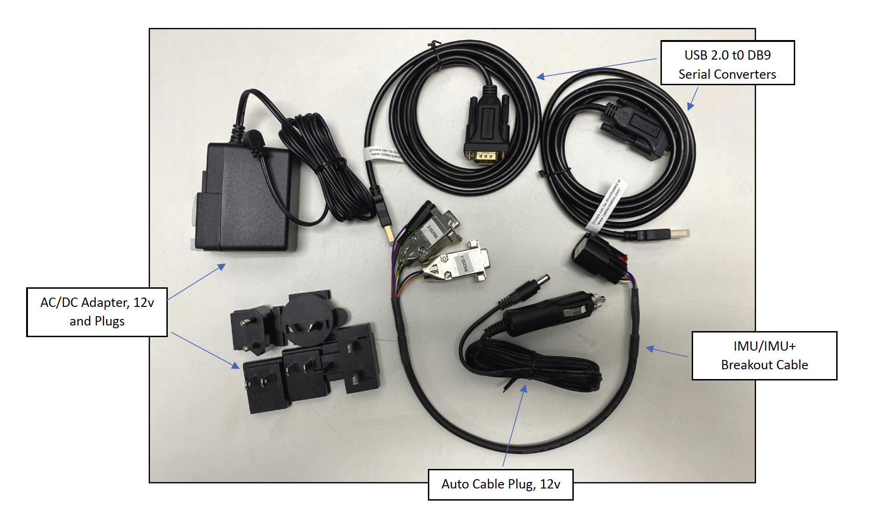

==================================
IMU/IMU+ Getting Started Guide
==================================
Thank you for choosing the ANELLO IMU! This guide will get you started with connection, configuration and data collection.
Please contact support@anellophotonics.com with any questions.  

1   Hardware Connections
---------------------------------
The ANELLO IMU unit is pictured below. It features an 8 pin automotive-grade Molex MX150 connector.

.. image:: media/ANELLO_IMU.png
   :width: 50 %
   :align: center
|
If you purchased the IMU Evaluation Kit, you will also receive the items pictured below. See `Mechanicals <https://docs-a1.readthedocs.io/en/latest/mechanicals.html>`_ for schematic of the breakout cable.

|

To use the IMU Evaluation Kit, connect the hardware as follows: 

1. Connect breakout cable to IMU unit
2. Connect to power using the AC/DC adapter.
3. Connect to PC, Mac, or Ubuntu computing system via RS-232 using USB 2.0 to DB9 Serial Converters.

For more information on hardware mechanicals, see `Mechanicals <https://docs-a1.readthedocs.io/en/latest/mechanicals.html#anello-imu-imu>`_.

2   Unit Configurations
---------------------------------
If you would like to use the ANELLO Python Program to connect, configure, and log data with the IMU, please use the following instructions.

2.1 Install ANELLO Python Program
~~~~~~~~~~~~~~~~~~~~~~~~~~~~~~~~~~
Confirm that Python is installed on your computer and the version is at least 3.6:

.. code-block:: python
    
    >python -V

Clone the GitHub repository:

.. code-block:: python

    git clone https://github.com/Anello-Photonics/user_tool.git

Install dependencies using pip:

.. code-block:: python
    
    >cd user_tool
    >pip install -r requirements.txt

If you have any errors with these steps, see `Set-Up Troubleshooting <https://docs-a1.readthedocs.io/en/latest/setup_troubleshooting.html#install-anello-python-program>`_.

Please run "git pull" periodically to make sure you are using the latest code.

2.2 Run the Python Tool 
~~~~~~~~~~~~~~~~~~~~~~~~~~~~~~~~~~~

.. code-block:: python
    
    >cd board_tools
    >python user_program.py

You will see *System Status* at the top, and *Main Menu* below. For more information, see `Set-Up Troubleshooting <https://docs-a1.readthedocs.io/en/latest/setup_troubleshooting.html#run-python-program>`_.

2.3 Connect to the IMU
~~~~~~~~~~~~~~~~~~~~~~~~~~~~~~~~~~~
Use the arrow keys to select *Connect*, then *COM*, then *Auto* to auto-detect the unit. You can also use *Manual* if you know the data and config ports.
You should now see the *System Status* updated with the device information.

For more information or if you experience any errors, see the `Set-Up Troubleshooting <https://docs-a1.readthedocs.io/en/latest/setup_troubleshooting.html#connect-to-evk>`_.

2.4 IMU Configurations
~~~~~~~~~~~~~~~~~~~~~~~~~~~~~~~~~~~
Select *Unit Configuration* from the main menu to see default configurations. To change any configurations, 
select *Edit*, then the configuration to change, then select the new value.

For more information, please see `Unit Configurations <https://docs-a1.readthedocs.io/en/latest/unit_configuration.html>`_.

3   Data Collection
---------------------------------
3.1 Log a Data File
~~~~~~~~~~~~~~~~~~~~~~~~~~~~~~~~~~~
In the main menu, select *Log*, then *Start*. Use the default filename or enter a custom name. 
The *System Status* will be updated with the logging information.

To end a log, select *Log* then *Stop*. Log files are saved in the "logs" directory in user_tool, 
grouped by month and day.

To export a log to CSV, Select *Log*, then *Export*, then choose the log file.
A CSV file containing the IMU output data will be saved in the "exports" directory, under the name of the original log file.
For more information on the output message format, see `Comminication & Messaging <https://docs-a1.readthedocs.io/en/latest/communication_messaging.html>`_.

3.2 Monitor Output
~~~~~~~~~~~~~~~~~~~~~~~~~~~~~~~~~~~
For a real-time display of the IMU data, select *Monitor* in the main menu. For the IMU unit, only the *IMU* tab will be populated.

Logging can be started and ended by clicking the LOG button.

**Congratulations!!!**
You have completed the IMU setup! Please contact support@anellophotonics.com with any questions. 