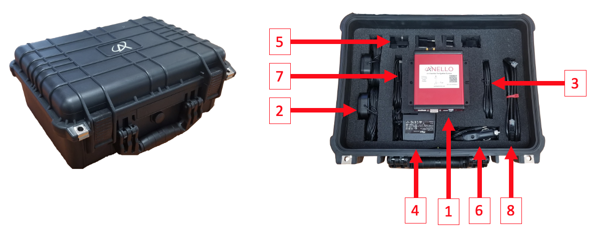

==================================
EVK Getting Started Guide
==================================
Thank you for choosing the ANELLO EVK! This guide will get you started with EVK connection, configuration and data collection.
Please contact support@anellophotonics.com with any questions.  

1   Hardware Connections
---------------------------------
The ANELLO Evaluation Kit (EVK) includes the following items:

    +---+------------------------------------------------+
    | 1 | ANELLO EVK                                     |
    +---+------------------------------------------------+
    | 2 | Two Dual-Band Multi-Constellation GNSS Antennae|
    +---+------------------------------------------------+
    | 3 | Power Cable                                    |
    +---+------------------------------------------------+
    | 4 | 110-240V AC Wall-Power Adapter                 |
    +---+------------------------------------------------+
    | 5 | International Wall-Power Plug Inserts          |
    +---+------------------------------------------------+
    | 6 | In-Vehicle Power Adapter                       |
    +---+------------------------------------------------+
    | 7 | USB Cable                                      |
    +---+------------------------------------------------+
    | 8 | Ethernet Cable                                 |
    +---+------------------------------------------------+

|

Connect the hardware as follows: 

1. Connect EVK to power using either the wall-power or the in-vehicle adapter (red).
2. Connect EVK to PC, MAC, or Ubuntu computing system using USB (blue) for configuration. If EVK is already configured, ethernet interface (green) is recommended for data collection since it is faster and more robust.
3. Connect primary GNSS antenna to ANT1 on the back of the EVK (black). An additional antenna (ANT2) is optional.

.. image:: media/EVK-wiring_2.png
   :width: 100 %
   :align: center

For more information on hardware mechanicals, see `Mechanicals <https://docs-a1.readthedocs.io/en/latest/mechanicals.html#anello-evk>`_.

2   Unit Configurations
---------------------------------
If you would like to use the ANELLO Python Program to connect, configure, and log data with the EVK, please use the following instructions.

2.1 Install ANELLO Python Program
~~~~~~~~~~~~~~~~~~~~~~~~~~~~~~~~~~
Confirm that Python is installed on your computer and the version is at least 3.6:

.. code-block:: python
    
    >python -V

Clone the GitHub repository:

.. code-block:: python

    git clone https://github.com/Anello-Photonics/user_tool.git

Install dependencies using pip:

.. code-block:: python
    
    >cd user_tool
    >pip install -r requirements.txt

If you have any errors with these steps, see `Set-Up Troubleshooting <https://docs-a1.readthedocs.io/en/latest/setup_troubleshooting.html#install-anello-python-program>`_.

Please run "git pull" periodically to make sure you are using the latest code.

2.2 Run the Python Tool 
~~~~~~~~~~~~~~~~~~~~~~~~~~~~~~~~~~~

.. code-block:: python
    
    >cd board_tools
    >python user_program.py

You will see *System Status* at the top, and *Main Menu* below. For more information, see `Set-Up Troubleshooting <https://docs-a1.readthedocs.io/en/latest/setup_troubleshooting.html#run-python-program>`_.

2.3 Connect to the EVK
~~~~~~~~~~~~~~~~~~~~~~~~~~~~~~~~~~~
Use the arrow keys to select *Connect*, then *COM*, then *Auto* to auto-detect the unit. You can also use *Manual* if you know the data and config ports.
You should now see the *System Status* updated with the device information.

For more information or if you experience any errors, see the `Set-Up Troubleshooting <https://docs-a1.readthedocs.io/en/latest/setup_troubleshooting.html#connect-to-evk>`_.

2.4 EVK Configurations
~~~~~~~~~~~~~~~~~~~~~~~~~~~~~~~~~~~
Select *Unit Configuration* from the main menu to see default configurations. To change any configurations, 
select *Edit*, then the configuration to change, then select the new value.

For more information, please see `Unit Configurations <https://docs-a1.readthedocs.io/en/latest/unit_configuration.html>`_.

3   Data Collection
---------------------------------

The following steps can be used to 

3.1 Log a Data File
~~~~~~~~~~~~~~~~~~~~~~~~~~~~~~~~~~~
In the main menu, select *Log*, then *Start*. Use the default filename or enter a custom name. 
The *System Status* will be updated with the logging information.

To end a log, select *Log* then *Stop*. Log files are saved in the "logs" directory in user_tool, 
grouped by month and day.

To export a log to CSV, Select *Log*, then *Export*, then choose the log file.
CSV files for each message (IMU, GPS, HDG, and INS) will be saved in the "exports" directory, under the name of the original log file. 
For more information on the output messages, see `Comminication & Messaging <https://docs-a1.readthedocs.io/en/latest/communication_messaging.html>`_.

INS solution can be visualized by importing ins.csv into `Kepler <https://kepler.gl/demo>`_

3.2 Monitor Output
~~~~~~~~~~~~~~~~~~~~~~~~~~~~~~~~~~~
For a real-time display of the INS solution, select *Monitor* in the main menu.

Logging can be started and ended by clicking the LOG button, and GNSS input can be turned on or off by clicking the GPS button.

3.3 Connect to NTRIP Caster
~~~~~~~~~~~~~~~~~~~~~~~~~~~~~~~~~~~
Connecting to NTRIP will improve the GNSS position accuracy by using RTK corrections.

From the main menu, select *NTRIP* and then *Start*. Enter the NTRIP caster details as prompted. 
The *System Status* will show the NTRIP connection status.

4   Vehicle Installation
----------------------------
4.1 Connect via Ethernet
~~~~~~~~~~~~~~~~~~~~~~~~~~~~~~~~~~~
The EVK Ethernet (UDP) interface is recommended for in-vehicle data collection. 

1. Find Computer Ethernet IP using ipconfig in terminal
2. In user_program.py, select *Unit Configurations*
   
   - Set Computer IP to that from step 1
   - Keep data and configuration port as 1111 and 2222 (these can be any number not  used for something else, e.g. your OS)
   
   If connecting EVK directly to computer:
   
   - Set DHCP to off
   - Set EVK IP to something with same prefix as Computer IP
   
   If connecting EVK to computer through router:
   
   - Set DHCP on
   - EVK IP will be auto-assigned after restart

3. Restart EVK and re-connect via COM
4. In main menu, select *Unit Configurations*, take note of EVK IP and data/config ports
5. In main menu, select *Connect* -> *UDP* -> Enter EVK IP and data/config ports

4.2 Install the EVK
~~~~~~~~~~~~~~~~~~~~~~~~~~~~~~~~~~~
The EVK can be configured for various installation positions. To minimize configuration steps, 
mount near the center of the vehicle’s rear axle, with the x-axis facing the direction of travel.

.. image:: media/a1_install_location.png
   :width: 50 %
   :align: center
|
The GNSS antennae can be magnetically mounted on the roof of the vehicle.

4.3 Set Vehicle Configurations
~~~~~~~~~~~~~~~~~~~~~~~~~~~~~~~~~~~
In main menu, select *Vehicle Configurations* and set the lever arms as prompted. For more informaiton, see `Vehicle Configurations <https://docs-a1.readthedocs.io/en/latest/vehicle_configuration.html>`_.

**Congratulations!!!**
You have completed the EVK setup! Please refer back to `Section 3 <https://docs-a1.readthedocs.io/en/latest/getting_started_quick.html#data-collection>`_ for data collection. 
Note that the EVK performance will improve after several minutes of driving.

Please contact support@anellophotonics.com with any questions. 
