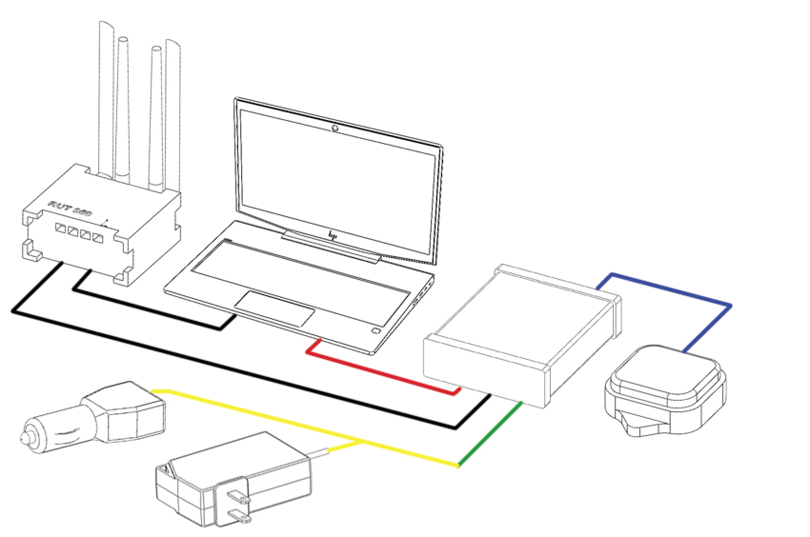

Quick Getting Started Guide
=======================

1. A-1 Hardware Connections
------------------------

The Anello A-1 EVK includes the eight items highlighted below:

.. figure:: media/evk_contents.png
   :align: center

   Figure 1: Anello A-1 EVK Contents
 
    +---+------------------------------------------------+
    | 1 | A-1 Inertial Navigation System                 +
    +---+------------------------------------------------+
    | 2 | Two Dual-Band Multi-Constellation GNSS Antennae|
    +---+------------------------------------------------+
    | 3 | A-1 System Power Cable                         |
    +---+------------------------------------------------+
    | 4 | 110-240VAC Wall-Power Adaptor Plug             |
    +---+------------------------------------------------+
    | 5 | International Wall Power Plug Inserts          |
    +---+------------------------------------------------+
    | 6 | In-Vehicle Power Adaptor                       |
    +---+------------------------------------------------+
    | 7 | USB-C Cable                                    |
    +---+------------------------------------------------+
    | 8 | Ethernet Cable                                 |
    +---+------------------------------------------------+

   Figure 2: Anello A-1 Connection Diagram

The power connection is made with the A-1 System Power Cable, which can be connected to the Wall-Power Adaptor 
or the In-Vehicle Power Adaptor (green/yellow).  
    
.. note::
    The unit should **NOT** be directly powered by USB-C.

The A-1 connects to a PC, MAC, or Ubuntu system using USB-C (red) to configure the unit with the Anello Python Program.
The USB interface is recommended for initial system checkout and configuration. 
USB connection generates four virtual COM ports on the host system, of which two are active (highest and lowest).

The Ethernet interface (black) is recommended for primary data collection and communication due to its speed and stability.

The GNSS antennae connections are shown in blue. the Primary Antennae connects to GPS1 on the back of the A-1.  
Connection of an additional antenna to GPS2 is optional.

2. Connect & Configuration of A-1
---------------------------------

2.1 Confirm that Python is installed and the version is at least 3.6
~~~~~~~~~~~~~~~~~~~~~~~~~~~~~~~~~~~
.. code-block:: python
    >python -V

2.2 Install Anello Python Program
~~~~~~~~~~~~~~~~~~~~~~~~~~~
Clone the GitHub repository:
.. code-block:: python
    >git clone https://github.com/Anello-Photonics/user_tool.git

Install dependencies using pip:
.. code-block:: python
    cd user_tools
    pip install -r requirements.txt

2.3 Run the Tool 
~~~~~~~~~~~~~~~~~~~~~~~~~~~~~~~~~~~
From the board_tools directory, run user_program.py. 

.. code-block:: python
    cd board_tools
    python user_program.py

2.4 Connect to the A-1
~~~~~~~~~~~~~~~~~~~~~~~~~~~~~~~~~~~
Use the arrows to select *Connect* and press enter. Select *COM* and then *Auto*. The unit will
be auto detected via Serial over USB-C. 

Select the COM ports. The Anello A-1 uses two logical ports: 

    +-------------------------+-----------------------------------+
    | **Logical Port**        |  **Physical Port** (Serial/USB-C) |
    +-------------------------+-----------------------------------+
    |  Data Port              | lowest port number e.g., COM7     |
    +-------------------------+-----------------------------------+
    |  Configuration  Port    | highest port number e.g., COM10   |
    +-------------------------+-----------------------------------+

2.5 Adjust unit configuration
~~~~~~~~~~~~~~~~~~~~~~~~~~~~~~~~~~~
Select *Configure* from the main menu. To change a configuration, select *Edit* and then the configuration to change. 
Select the new value.

General configurations:

-   Output Data Rate    (20/50/100/200) - rate of INS and IMU message outputs in Hz. Default: 100
-   Orientation         (+X+Y+Z or other right handed frames) - coordinate system for A-1. Default: +X+Y+Z
-   Enable GPS          (on/off) - let the A-1 use the GPS antenna. Default: on
-   Odometer Unit       (mps/mph/kph/fps) - speed unit for odometer input. Default: mph
-   Enable FOG          (on/off) - let the A-1 use the Fiber Optic Gyro for angular rate z. Default: on

UDP connection configurations:

-   DHCP (on/off)                     If on, the A-1 ip is assigned by router. If off, pick the IP yourself.
-   UDP  A-1 ip                       IP address for the A-1. Can only set this when DHCP off
-   UDP computer ip                   IP address of your computer, which A-1 will connect to.
-   UDP computer data port            Remote device's port for data channel. This works like the data and config com ports.
-   UDP computer configuration port   Remote devices port for config channel

2.5.1 Connecting by UDP
~~~~~~~~~~~~~~~~~~~~~~~~~~~~~~~~~~~
The A-1 Ethernet (UDP) interface is recommended for in-vehicle data collection. To connect by UDP over Ethernet: 

1. Configure the A-1 over COM (section 2.4).
2. Set the A-1 IP address statically or automatically using DHCP (default)
3. Set the IP address of where you want the A-1 to send data, i.e., the receiving computer's IP
4. Set the Data Port and User Messaging Port numbers
5. Connect to the A-1 via UDP instead of USB. Use the same A-1 IP, configuration port and data port as in steps 2 & 3.

**Congratulations!!!**
You have completed the initial setup of the Anello A-1.

2.6 Set Vehicle Configurations
~~~~~~~~~~~~~~~~~~~~~~~~~~~~~~~~~~~
When you're ready to install the A-1 in your vehicle, set up vehicle configurations to optimize the navigation algorithm.
From the main menu, select *Vehicle Configurations* to set the following:

- Position of both GPS antennas
- Center of rear wheels, for odometer
- Origin for navigation output

See the Vehicle Configurations page for more details.

2.7 Log a data file
~~~~~~~~~~~~~~~~~~~~~~~~~~~~~~~~~~~
Logging collects all A-1 output messages into a single text file, which can be exported into separate CSV files for each message type.

While connected by COM or UDP, select *Log* in the main menu, then *Start*. Use either the default name or enter a custom name.
The current log file is show in *System Status* above the main menu. To end the log, select *Log* and then *Stop*.

The log files are saved in the "logs" directory within user_tools, grouped by month and then day.

To export a log file to CSV, Select *Log* in the main menu, then *Export*. Select the log file to convert to CSV.
Three CSV files will be saved in the exports directory, under the name of the original log file:

-   imu.csv : raw IMU data such as acceleration and angular rates (APIMU messages)
-   gps.csv : GNSS data (APGPS messages)
-   ins.csv : primary inertial navigation solution data (APINS messages)

If the A-1 antenna was collecting GNSS data during logging, the exported CSVs can be visualized at `Kepler <https://kepler.gl/demo>`_, an online tool for geo-spatial data analysis. 

2.8 Monitor Output
~~~~~~~~~~~~~~~~~~~~~~~~~~~~~~~~~~~
Monitoring mode opens a display to watch the data of the INS solution in real-time.
It also allows toggling the logging and GNSS connection with the LOG and GPS buttons

To start monitoring, select *Monitor* in the main menu. This will launch a separate window.

.. figure:: media/monitoring.png
   :scale: 50 %
   :align: center

To return to the main menu, close the Monitoring window.

2.9 Connect to NTRIP Caster
~~~~~~~~~~~~~~~~~~~~~~~~~~~~~~~~~~~
Connecting to an NTRIP caster will improve the accuracy of GNSS positioning using RTK corrections.
For firmware versions 0.4.3 and earlier, NTRIP requires the A-1 to be connected by UDP.

From the main menu, select *NTRIP* and then *Start*. Then enter the NTRIP caster details as prompted

-   caster: URL or IP address
-   port: usually 2101
-   mountpoint
-   username
-   password
-   send GGA (yes/no) - whether the caster requires a GGA message for the device position.

The system status will show the NTRIP connection status. The details of the last used caster are saved.

2.10 Firmware Upgrade
~~~~~~~~~~~~~~~~~~~~~~~~~~~~~~~~~~~
To upgrade firmware: Connect over COM, select *UPGRADE* from the main menu, then *yes*. Follow the instructions on the screen.
The upgrade currently requires the windows executable included in the user_tools repo, HtxAurixBootLoader.exe.
The A-1 output will halt until the upgrade is complete. The new firmware version number will show in system status.

3. Vehicle Installation
------------------------
The mounting location of the A-1 is flexible and can be configured for various installation positions and orientations.  
To minimize configuration steps, mount the unit nearer the vehicle’s rear axle and along the vehicle 
centerline with the X-Axis facing forward along the direction of travel.  This mounting location will ensure 
good results with minimal configuration.

.. figure:: media/a1_install_location.png
   :scale: 50 %
   :align: center

   Default A-1 Installation Location

The GNSS antennae should be placed on the roof of the vehicle. The primary GNSS antenna is labelled GPS1 on 
the back of the A-1, which must be connected for proper system operation.  GPS2 is optional. 
The antennae provided in the Anello EVK magnetically mounts to the vehicle roof. 

.. note::

    Use of a single band (L1 only) GNSS antennae will result in a significant reduction of accuracy and 
    likely prevent RTK from working. Please ensure the antennae has at least dual-band support.

You are now ready to collect data!  Note that the system typically requires exceeding 2m/s velocity to enter full INS mode, 
and the performance will generally improve after the first 5 minutes of driving.