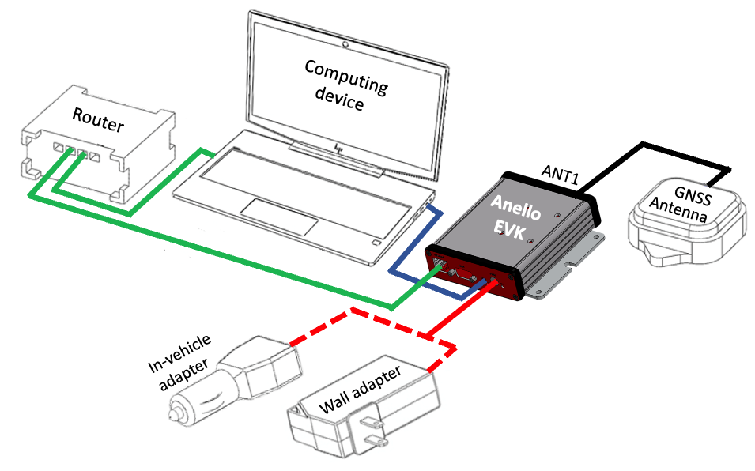

==================================
Getting Started Guide
==================================
Thank you for choosing the Anello EVK! The following guide will get you started with connecting, configuration, and data collection with the EVK.
Please contact support@anellophotonics.com with any questions.  

1   Hardware Connections
---------------------------------
The Anello Evaluation Kit (EVK) includes the following items:

    +---+------------------------------------------------+
    | 1 | Anello EVK                                     |
    +---+------------------------------------------------+
    | 2 | Two Dual-Band Multi-Constellation GNSS Antennae|
    +---+------------------------------------------------+
    | 3 | Power Cable                                    |
    +---+------------------------------------------------+
    | 4 | 110-240V AC Wall-Power Adaptor                 |
    +---+------------------------------------------------+
    | 5 | International Wall-Power Plug Inserts          |
    +---+------------------------------------------------+
    | 6 | In-Vehicle Power Adaptor                       |
    +---+------------------------------------------------+
    | 7 | USB Cable                                      |
    +---+------------------------------------------------+
    | 8 | Ethernet Cable                                 |
    +---+------------------------------------------------+

.. image:: media/evk_contents.png
   :width: 75 %
   :align: center
|

Connect the hardware as follows: 

1. Connect EVK to power using either the wall-power adaptor or the in-vehicle adaptor (red). The unit should **NOT** be directly powered by USB-C.
2. Connect EVK to PC, MAC, or Ubuntu computing system using USB (blue) for configuration. If EVK is already configured, Ethernet interface (green) is recommended for data collection since it is faster and more robust than virtual COM.
3. Connect GNSS antenna to ANT1 on the back of  EVK (black). An additional antenna (ANT2) is optional.

|
2   Unit Configurations
---------------------------------
2.1 Install Anello Python Program
~~~~~~~~~~~~~~~~~~~~~~~~~~~~~~~~~~
Confirm that Python is installed and the version is at least 3.6:

.. code-block:: python
    
    >python -V

Clone the GitHub repository:

.. code-block:: python

    git clone https://github.com/Anello-Photonics/user_tool.git

Install dependencies using pip:

.. code-block:: python
    
    >cd user_tools
    >pip install -r requirements.txt

If you have any errors with these steps, see the `Set-Up Troubleshooting <https://docs-a1.readthedocs.io/en/latest/setup_troubleshooting.html#install-anello-python-program>`_.

2.2 Run the Python Tool 
~~~~~~~~~~~~~~~~~~~~~~~~~~~~~~~~~~~

.. code-block:: python
    
    >cd board_tools
    >python user_program.py

You will see *System Status* at the top, and *Main Menu* below.

2.3 Connect to the EVK
~~~~~~~~~~~~~~~~~~~~~~~~~~~~~~~~~~~
Use the arrow keys to select *Connect* and press enter. Select *COM* then *Auto* to auto-detect the unit. 
You should now see the *System Status* updated with the Device and Connection information.

For more information or if you experience any errors, please see the "Set-Up Troubleshooting" tab.

2.4 EVK Configurations
~~~~~~~~~~~~~~~~~~~~~~~~~~~~~~~~~~~
Select *User Configuration* from the main menu to see default configurations. To change any configurations, 
select *Edit*, then the configuration to change, then select the new value.

For more information, please see the `Unit Configurations <https://docs-a1.readthedocs.io/en/latest/unit_configuration.html>`_.

3   Data Collection
---------------------------------
3.1 Monitor Output
~~~~~~~~~~~~~~~~~~~~~~~~~~~~~~~~~~~
For a real-time display of the INS solution, select *Monitor* in the main menu.

Logging can be started and ended by clicking the LOG button.
GNSS input can be turned on or off by clicking the GPS button.

3.2 Log a Data File
~~~~~~~~~~~~~~~~~~~~~~~~~~~~~~~~~~~
In the main menu, select *Log*, then *Start*. Use the default filename or enter a custom name. 
The *System Status* will be updated with the logging information.

To end the log, select *Log* then *Stop*. Log files are saved in the "logs" directory in user_tools, 
grouped by month and day.

To export a log file to CSV, Select *Log* in the main menu, then *Export*, then choose the log file.
Three CSV files (imu.csv, gps.csv, and ins.csv) will be saved in the "exports" directory, under the name of the original log file.

Data can be visualized by importing ins.csv into `Kepler <https://kepler.gl/demo>`_

3.3 Connect to NTRIP Caster
~~~~~~~~~~~~~~~~~~~~~~~~~~~~~~~~~~~
Connecting to an NTRIP caster will improve the accuracy of GNSS positioning using RTK corrections.

From the main menu, select *NTRIP* and then *Start*. Enter the NTRIP caster details as prompted. 
The *System Status* will show the NTRIP connection status.

|
4   Vehicle Installation
----------------------------
4.1 Connect via Ethernet
~~~~~~~~~~~~~~~~~~~~~~~~~~~~~~~~~~~
The EVK Ethernet (UDP) interface is recommended for in-vehicle data collection. 

1. Find Computer Ethernet IP using ipconfig in cmd window
2. In user_program.py, select *Unit Configurations*
       - Set Computer IP to that from step 1
       - Keep data and configuration port as 1111 and 2222 (this can be any number, as long as it’s not being used for something else e.g. by your OS)
    If connecting EVK directly to computer:
       - Set DHCP to off
       - Set EVK IP to something with same prefix as Computer IP
    If connecting EVK to computer through router:
       - Set DHCP on
       - EVK IP will be auto-assigned after restart
3. Restart EVK and re-connect via COM
4. In main menu, select *Unit Configurations*, take note of EVK IP address and data/configuration ports
5. In main menu, select Connect -> UDP -> Enter EVK IP and data/config ports

4.2 Install the EVK
~~~~~~~~~~~~~~~~~~~~~~~~~~~~~~~~~~~
The EVK can be configured for various installation positions. To minimize configuration steps, 
mount the unit near the center of the vehicle’s rear axle, with the X-Axis facing the direction of travel.

.. image:: media/a1_install_location.png
   :width: 50 %
   :align: center
|
The GNSS antennae can be magnetically mounted on the roof of the vehicle.

4.3 Set Vehicle Configurations
~~~~~~~~~~~~~~~~~~~~~~~~~~~~~~~~~~~
In the main menu, select *Vehicle Configurations* and set the positions as prompted. For more informaiton, see `Vehicle Configurations <https://docs-a1.readthedocs.io/en/latest/vehicle_configuration.html>`_.

**Congratulations!!!**
You have completed the EVK setup! Please refer back to `Section 3 <https://docs-a1.readthedocs.io/en/latest/getting_started_quick.html#data-collection>`_ for data collection. 
Note that the EVK performance will improve after several minutes of driving.