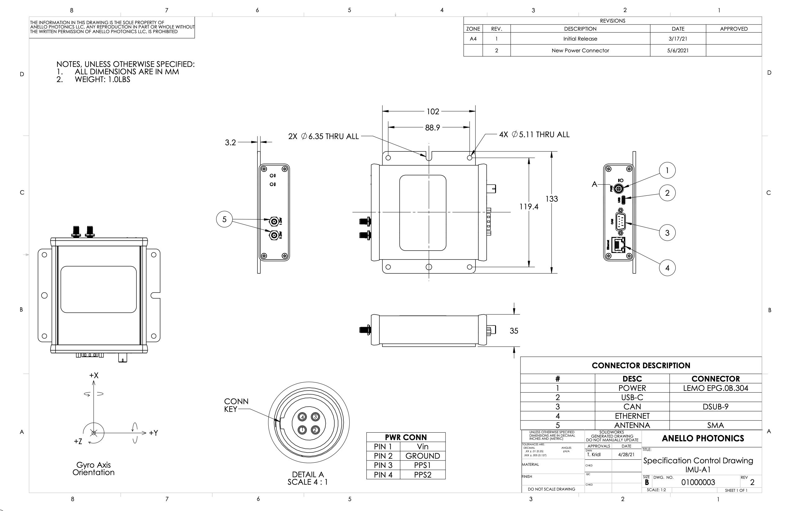

Mechanicals
==================

The current Anello A-1 revision features a 4-pin power connector.  The 4-pin power connector version includes the PPS signals
for both the internal GNSS Modules of the Anello A-1.

The previous revision of the Anello A-1 has a two pin power connector.  This power connector is simply power and ground.

The connector pinout, cable information and dimensions of the box are found below

4-Pin (4-Pin Power Connector) :download:`PDF <media/Anello_A1_MechanicalDwg_rev2.pdf>`

A-1 (2-Pin Power Connector) :download:`PDF <media/Anello_A1_MechanicalDwg.pdf>`

.. figure:: media/Anello_A1_MechanicalDwg.png
   :align: center

.. note::
   More information on the Anello A-1 power connector and options for a mating connector:
   
   General Info: `<https://www.lemo.com/en/products/low-voltage-connector/b-connector>`_
   
   Rev 2 (4 pin): `<https://www.lemo.com/pdf/FGG.0B.304.CLAD52.pdf>`_                                                      
   
   Rev 1 (2 pin): `<https://www.lemo.com/pdf/FGG.0B.302.CLAD52.pdf>`_     